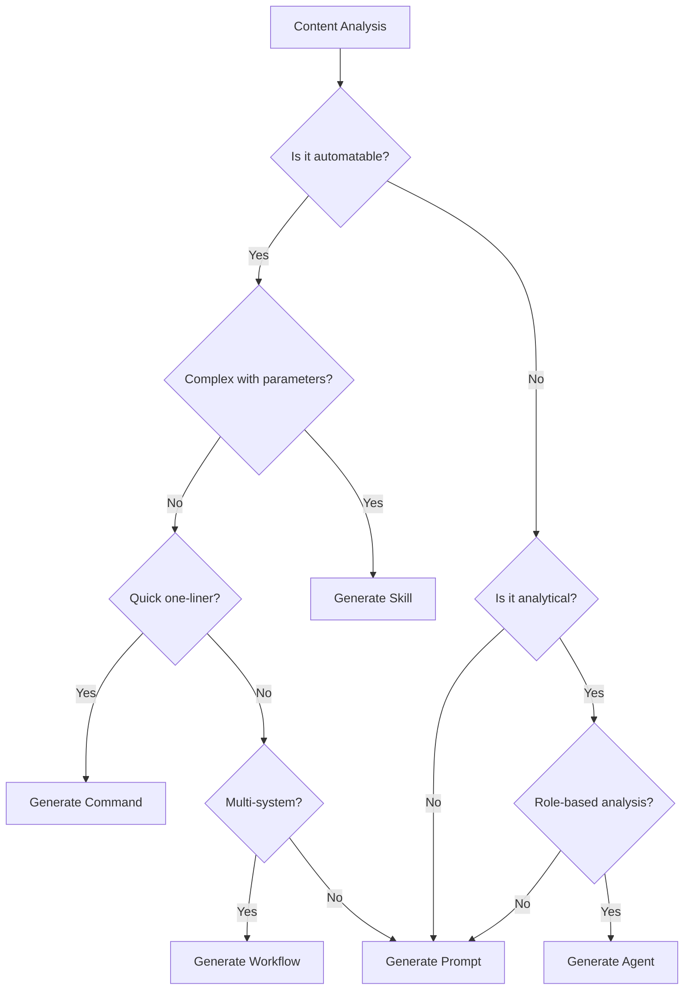

# Asset Type Decision Logic Guide
## Empire v7.2 - Comprehensive Decision Trees for Asset Generation

### Overview
This document provides detailed decision logic for determining which asset types to generate from any given content. The orchestrator uses these decision trees to make intelligent choices about skills vs commands vs agents vs prompts vs workflows.

---

## 1. Primary Decision Tree



---

## 2. Detailed Asset Type Criteria

### 2.1 Claude Skills (`.yaml`)

**Generate a Skill When:**
- ✅ Complex automation with multiple steps
- ✅ Requires parameters and configuration
- ✅ Has error handling requirements
- ✅ Saves significant time when automated
- ✅ Reusable across different contexts
- ✅ Involves decision logic or branching

**Key Indicators in Content:**
- "automate", "automation", "workflow"
- "process", "procedure", "routine"
- "repetitive task", "recurring operation"
- Step-by-step instructions with conditions
- Multiple related operations

**Example Scenarios:**
```yaml
# Generate skill for:
1. "Automated report generation from multiple data sources"
2. "Customer onboarding workflow with verification steps"
3. "Data processing pipeline with transformation rules"
4. "Deployment automation with rollback capability"
```

### 2.2 Claude Commands (`.md`)

**Generate a Command When:**
- ✅ Simple, quick action needed
- ✅ One-liner or very short operation
- ✅ Frequently used shortcut
- ✅ No complex logic required
- ✅ Direct query or lookup
- ✅ Single-purpose utility

**Key Indicators in Content:**
- "quick", "shortcut", "alias"
- "check", "look up", "find"
- "simple command", "utility"
- Single action descriptions
- "/command" format mentions

**Example Scenarios:**
```markdown
# Generate command for:
1. "/check-api-status" - Quick API health check
2. "/today-tasks" - List today's tasks
3. "/convert-currency USD EUR 100" - Simple conversion
4. "/search-docs keyword" - Quick documentation search
```

### 2.3 CrewAI Agents (`.yaml`)

**Generate an Agent When:**
- ✅ Multi-step intelligent analysis required
- ✅ Role-based task (analyst, advisor, coach)
- ✅ Requires reasoning and decision-making
- ✅ Needs to collaborate with other agents
- ✅ Complex research or investigation
- ✅ Autonomous goal-oriented behavior

**Key Indicators in Content:**
- "analyze", "research", "investigate"
- "evaluate", "assess", "review"
- "advisor", "consultant", "expert"
- Role descriptions (e.g., "acts as a...")
- Complex analytical requirements

**Example Scenarios:**
```yaml
# Generate agent for:
1. "Financial analyst reviewing quarterly reports"
2. "Code reviewer checking for best practices"
3. "Market researcher analyzing competitor strategies"
4. "Learning coach personalizing study plans"
```

### 2.4 AI Prompts (`.md`)

**Generate a Prompt When:**
- ✅ Reusable template needed
- ✅ Standardized format required
- ✅ Variables/placeholders present
- ✅ Consistency across uses important
- ✅ Default choice when unclear
- ✅ Structure for AI interactions

**Key Indicators in Content:**
- "template", "format", "structure"
- "example", "pattern", "model"
- Variables like {{name}}, {variable}
- Standardized communication needs
- Response format specifications

**Example Scenarios:**
```markdown
# Generate prompt for:
1. "Email response template for customer inquiries"
2. "Code review checklist format"
3. "Meeting summary structure"
4. "Report generation template"
```

### 2.5 n8n Workflows (`.json`)

**Generate a Workflow When:**
- ✅ Multi-system integration needed
- ✅ Sequential processing pipeline
- ✅ Event-driven automation
- ✅ Scheduled/triggered operations
- ✅ Data transformation between systems
- ✅ Complex orchestration requirements

**Key Indicators in Content:**
- "integration", "connect", "sync"
- "pipeline", "sequence", "flow"
- "trigger", "schedule", "event"
- Multiple system mentions
- Data flow descriptions

**Example Scenarios:**
```json
# Generate workflow for:
1. "Daily data sync between CRM and database"
2. "Multi-stage document processing pipeline"
3. "Event-triggered notification system"
4. "Scheduled report generation and distribution"
```

---

## 3. Multi-Asset Generation Logic

### 3.1 When to Generate Multiple Assets

Content often warrants multiple asset types. Use this matrix:

| Content Type | Primary Asset | Secondary Assets | Conditions |
|--------------|---------------|------------------|------------|
| **Training Module** | Prompt (templates) | Agent (coach), Skill (exercises) | Educational content with exercises |
| **System Integration** | Workflow | Commands (testing), Skills (operations) | Multi-system with operations |
| **Process Documentation** | Skill | Prompt (communication), Workflow (full process) | Complex process with multiple touchpoints |
| **Analysis Framework** | Agent | Prompt (report template), Workflow (data gathering) | Analytical process with reporting |
| **API Documentation** | Commands | Skill (complex operations), Workflow (testing) | API with various operation levels |

### 3.2 Asset Combination Patterns

```python
# Common combinations and their triggers

patterns = {
    "full_automation": {
        "triggers": ["end-to-end", "complete automation", "full pipeline"],
        "assets": ["workflow", "skill", "command"],
        "reason": "Complete automation needs orchestration, operations, and shortcuts"
    },

    "analytical_suite": {
        "triggers": ["analysis framework", "research methodology", "evaluation process"],
        "assets": ["agent", "prompt", "workflow"],
        "reason": "Analysis needs intelligence, templates, and data flow"
    },

    "educational_package": {
        "triggers": ["course", "training", "tutorial", "workshop"],
        "assets": ["agent", "prompt", "skill"],
        "reason": "Education needs coaching, exercises, and practice automation"
    },

    "operational_toolkit": {
        "triggers": ["operations manual", "SOP", "procedures"],
        "assets": ["skill", "command", "workflow"],
        "reason": "Operations need automation at multiple levels"
    }
}
```

---

## 4. Decision Factors and Weights

### 4.1 Primary Factors (High Weight)

| Factor | Weight | Impact on Decision |
|--------|--------|-------------------|
| **Complexity** | 40% | Complex → Skill/Agent/Workflow<br>Simple → Command/Prompt |
| **Automation Need** | 30% | High → Skill/Workflow<br>Low → Prompt/Agent |
| **Reusability** | 20% | High → Skill/Prompt<br>Low → Command |
| **Intelligence Required** | 10% | High → Agent<br>Low → Command/Skill |

### 4.2 Secondary Factors (Low Weight)

| Factor | Weight | Impact on Decision |
|--------|--------|-------------------|
| **Content Length** | 5% | Long → Agent/Workflow<br>Short → Command |
| **User Expertise** | 5% | Expert → Skill/Workflow<br>Beginner → Command/Prompt |
| **Frequency of Use** | 5% | High → Command/Skill<br>Low → Agent/Workflow |
| **Integration Needs** | 5% | High → Workflow<br>Low → Standalone assets |

---

## 5. Edge Cases and Special Rules

### 5.1 Ambiguous Content

**When content could be multiple asset types:**
1. Default to **Prompt** (most flexible)
2. Consider generating multiple assets
3. Let user feedback guide final decision

### 5.2 Content-Specific Rules

| Content Pattern | Always Generate | Never Generate | Notes |
|-----------------|-----------------|----------------|-------|
| API Documentation | Commands | - | APIs always need quick test commands |
| Video Transcripts | Prompt + Summary | Workflow | Videos need templates, not automation |
| Code Repositories | Skills | Agent | Code needs automation, not analysis |
| Course Materials | Agent + Prompts | - | Courses need coaching and exercises |
| Process Docs | Skill + Workflow | - | Processes need multiple automation levels |

### 5.3 Department-Specific Preferences

```python
department_preferences = {
    "it-engineering": ["skill", "command", "workflow"],  # Technical prefers automation
    "sales-marketing": ["agent", "prompt", "workflow"],  # Sales prefers intelligence
    "customer-support": ["prompt", "command", "skill"],  # Support prefers templates
    "finance-accounting": ["workflow", "skill", "agent"],  # Finance prefers processes
    "project-management": ["agent", "workflow", "prompt"],  # PM prefers coordination
    "personal-continuing-ed": ["agent", "prompt", "skill"],  # Education prefers learning
    "_global": ["prompt", "skill", "agent"]  # Global is balanced
}
```

---

## 6. Confidence Scoring

### 6.1 Asset Type Confidence Calculation

```python
def calculate_asset_confidence(content, asset_type):
    """
    Calculate confidence score for generating specific asset type
    Returns: float between 0.0 and 1.0
    """
    confidence = 0.0

    # Check keyword matches
    keyword_score = count_keywords(content, asset_keywords[asset_type])
    confidence += min(keyword_score * 0.1, 0.4)  # Max 40% from keywords

    # Check complexity match
    complexity = assess_complexity(content)
    if complexity_matches_asset(complexity, asset_type):
        confidence += 0.3  # 30% from complexity match

    # Check structure match
    if structure_matches_asset(content, asset_type):
        confidence += 0.2  # 20% from structure

    # Check department alignment
    department = classify_department(content)
    if asset_type in department_preferences[department][:2]:
        confidence += 0.1  # 10% from department preference

    return confidence
```

### 6.2 Confidence Thresholds

| Confidence Range | Action |
|-----------------|--------|
| 0.8 - 1.0 | Generate with high priority |
| 0.6 - 0.8 | Generate normally |
| 0.4 - 0.6 | Generate if no better options |
| 0.2 - 0.4 | Consider but likely skip |
| 0.0 - 0.2 | Do not generate |

---

## 7. Examples and Test Cases

### 7.1 Example 1: Sales Training Course

**Content:** "Advanced B2B Sales Methodology covering lead qualification, pipeline management, and closing techniques with role-play exercises"

**Analysis:**
- Complexity: High
- Keywords: "methodology", "exercises", "techniques"
- Structure: Educational with practical components

**Decision:**
- **Primary:** Agent (Sales Coach) - Confidence: 0.85
- **Secondary:** Prompts (Templates) - Confidence: 0.75
- **Tertiary:** Skill (Exercise Automation) - Confidence: 0.60
- **Summary:** Yes (Educational content)

### 7.2 Example 2: API Integration Guide

**Content:** "REST API endpoints for user management with authentication, CRUD operations, and webhook configuration"

**Analysis:**
- Complexity: Moderate
- Keywords: "API", "endpoints", "operations"
- Structure: Technical documentation

**Decision:**
- **Primary:** Commands (Quick tests) - Confidence: 0.90
- **Secondary:** Skill (Complex operations) - Confidence: 0.70
- **Tertiary:** Workflow (Full integration) - Confidence: 0.65
- **Summary:** Yes (Technical documentation)

### 7.3 Example 3: Daily Standup Template

**Content:** "Template for daily standup meetings: Yesterday's accomplishments, today's plan, blockers"

**Analysis:**
- Complexity: Simple
- Keywords: "template", "daily", "meetings"
- Structure: Simple template

**Decision:**
- **Primary:** Prompt (Template) - Confidence: 0.95
- **Secondary:** Command (Quick standup) - Confidence: 0.50
- **Summary:** No (Simple template)

---

## 8. Implementation Checklist

### For Orchestrator Implementation:

- [ ] Parse content for keyword indicators
- [ ] Assess complexity level
- [ ] Identify content structure
- [ ] Calculate confidence scores
- [ ] Apply department preferences
- [ ] Check for multi-asset patterns
- [ ] Make final asset decisions
- [ ] Generate appropriate filenames
- [ ] Route to correct generators
- [ ] Track decision metrics

### For Quality Assurance:

- [ ] Verify asset type matches content
- [ ] Check for missing asset opportunities
- [ ] Validate confidence thresholds
- [ ] Review multi-asset combinations
- [ ] Ensure department alignment
- [ ] Confirm filename conventions
- [ ] Test edge cases
- [ ] Monitor user feedback

---

## 9. Metrics and Optimization

### 9.1 Track Decision Accuracy

```python
metrics_to_track = {
    "asset_type_accuracy": "% of correct asset type decisions",
    "multi_asset_precision": "% of appropriate multi-asset generations",
    "department_alignment": "% matching department preferences",
    "confidence_calibration": "Correlation between confidence and success",
    "user_satisfaction": "% of assets approved without changes"
}
```

### 9.2 Continuous Improvement

1. **Weekly Review:** Analyze decision patterns and accuracy
2. **Feedback Loop:** Incorporate user corrections
3. **Keyword Updates:** Refine indicator keywords
4. **Weight Adjustment:** Tune decision factors
5. **Pattern Learning:** Identify new asset combinations

---

## 10. Quick Decision Reference

### Fast Decision Matrix

| If Content Contains... | First Choice | Second Choice | Skip |
|-----------------------|--------------|---------------|------|
| Step-by-step process | Skill | Workflow | Agent |
| "How to analyze..." | Agent | Prompt | Command |
| "Quick check..." | Command | Skill | Workflow |
| "Template for..." | Prompt | - | Agent |
| "Integrate X with Y" | Workflow | Skill | Command |
| "Framework for..." | Agent | Prompt | Command |
| "Automate..." | Skill | Workflow | Prompt |
| Educational material | Agent | Prompt | Command |

---

*This decision logic guide should be continuously updated based on real-world usage patterns and user feedback. The goal is to achieve >90% accuracy in asset type decisions.*