# Empire v7.3 Workflow Diagrams

**Version**: 7.3
**Last Updated**: 2025-01-17

This document provides visual representations of Empire's core workflows and system interactions using Mermaid diagrams and ASCII illustrations.

---

## Table of Contents

1. [System Architecture Overview](#system-architecture-overview)
2. [Authentication Flow](#authentication-flow)
3. [Query Processing Workflows](#query-processing-workflows)
4. [Document Processing Pipeline](#document-processing-pipeline)
5. [CrewAI Multi-Agent Orchestration](#crewai-multi-agent-orchestration)
6. [Caching Architecture](#caching-architecture)
7. [Security & RBAC](#security--rbac)
8. [Monitoring & Observability](#monitoring--observability)

---

## System Architecture Overview

### High-Level Architecture

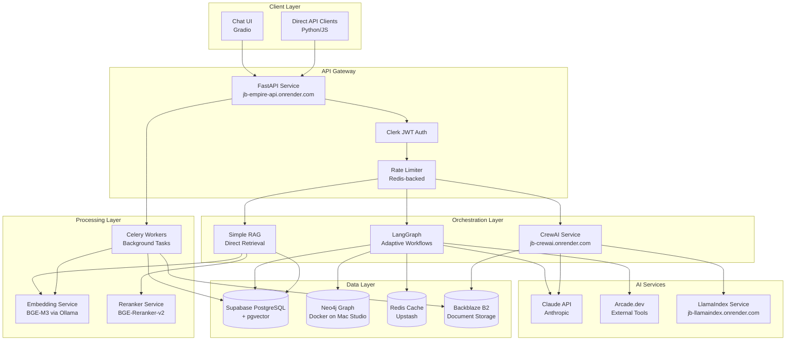

**Key Components**:
- **FastAPI**: Main API gateway with Clerk authentication and Redis-backed rate limiting
- **LangGraph**: Adaptive query workflows with iterative refinement (Task 46)
- **CrewAI**: Multi-agent orchestration for complex document processing
- **Supabase**: PostgreSQL + pgvector for vector search and user data
- **Neo4j**: Knowledge graph for entity relationships
- **Redis**: Semantic caching (Task 43.3) and Celery broker
- **Ollama**: Local embedding (BGE-M3) and reranking (BGE-Reranker-v2)

---

## Authentication Flow

### Clerk JWT Authentication

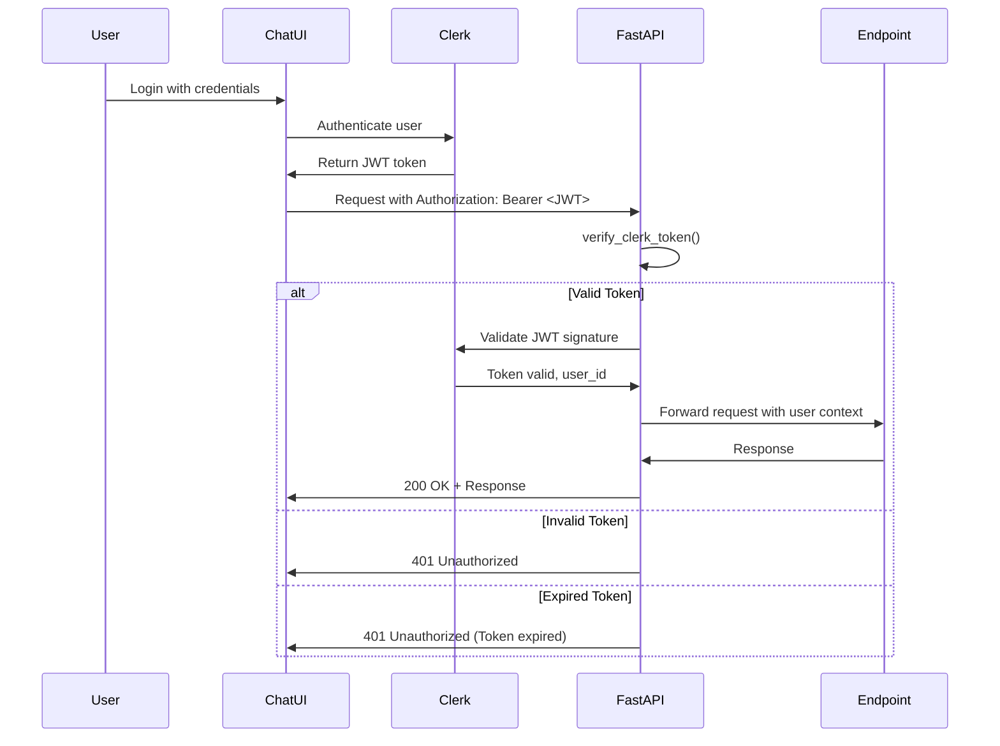

**Authentication Steps**:
1. User logs in via Clerk (email/password, OAuth, etc.)
2. Clerk issues JWT token with 24-hour expiration
3. Client includes token in `Authorization: Bearer <token>` header
4. FastAPI validates token signature with Clerk
5. If valid, request proceeds with user context
6. If invalid/expired, returns 401 Unauthorized

**Token Structure**:
```json
{
  "iss": "https://clerk.example.com",
  "sub": "user_abc123",
  "exp": 1705588800,
  "iat": 1705502400,
  "email": "user@example.com",
  "role": "user"
}
```

---

## Query Processing Workflows

### 1. Auto-Routed Query Flow

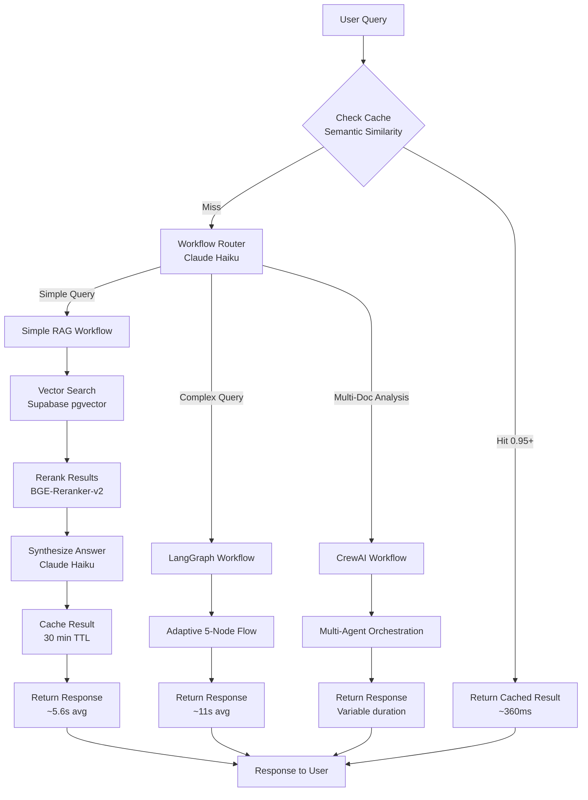

**Workflow Selection Logic**:

| Query Type | Indicators | Selected Workflow |
|------------|-----------|-------------------|
| Simple Lookup | "What is X?", "Define Y" | Simple RAG |
| Complex Research | "Compare X with Y", "Analyze trends" | LangGraph |
| Multi-Document | "Summarize these 10 docs", "Extract from multiple sources" | CrewAI |

**Example Routing**:
- "What are California insurance requirements?" → Simple RAG (direct lookup)
- "How do California requirements compare to Texas?" → LangGraph (needs external data + comparison)
- "Analyze sentiment across 50 customer reviews" → CrewAI (multi-document processing)

---

### 2. LangGraph Adaptive Workflow (5 Nodes)

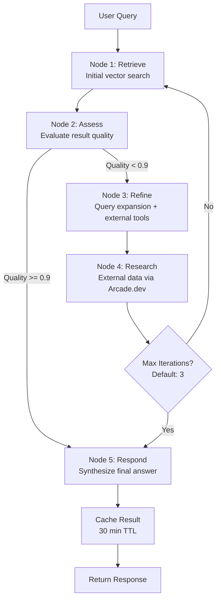

**Node Details**:

**Node 1: Retrieve**
- Vector search in Supabase (top 10 results)
- Graph traversal in Neo4j (2-hop relationships)
- Combine results with relevance scoring

**Node 2: Assess**
- Evaluate retrieval quality (0.0-1.0 score)
- Check if answer can be formed from retrieved docs
- Decision: Respond immediately or refine query

**Node 3: Refine**
- Query expansion with Claude Haiku (4-5 variations)
- Identify missing information
- Prepare for external tool usage

**Node 4: Research**
- Invoke Arcade.dev tools (Google.Search, etc.)
- Retrieve external data to fill gaps
- Combine with internal knowledge base

**Node 5: Respond**
- Synthesize final answer from all sources
- Include citations and confidence scores
- Format response with metadata

**Iteration Example**:
```
Query: "What are the latest California insurance requirements?"

Iteration 1:
- Retrieve: Find internal policy docs from 2024
- Assess: Quality 0.7 (docs might be outdated)
- Refine: Expand to "California insurance requirements 2025 updated"
- Research: Google Search for latest regulations

Iteration 2:
- Retrieve: Re-search with expanded query
- Assess: Quality 0.95 (found 2025 updates)
- Respond: Synthesize with both internal + external sources
```

---

### 3. Simple RAG Workflow

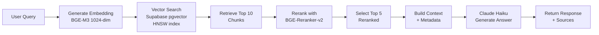

**Performance**:
- Average latency: ~5.6 seconds (uncached)
- Cache hit latency: ~360ms
- Cache hit rate: 66.7% for similar queries

---

## Document Processing Pipeline

### Document Upload & Processing

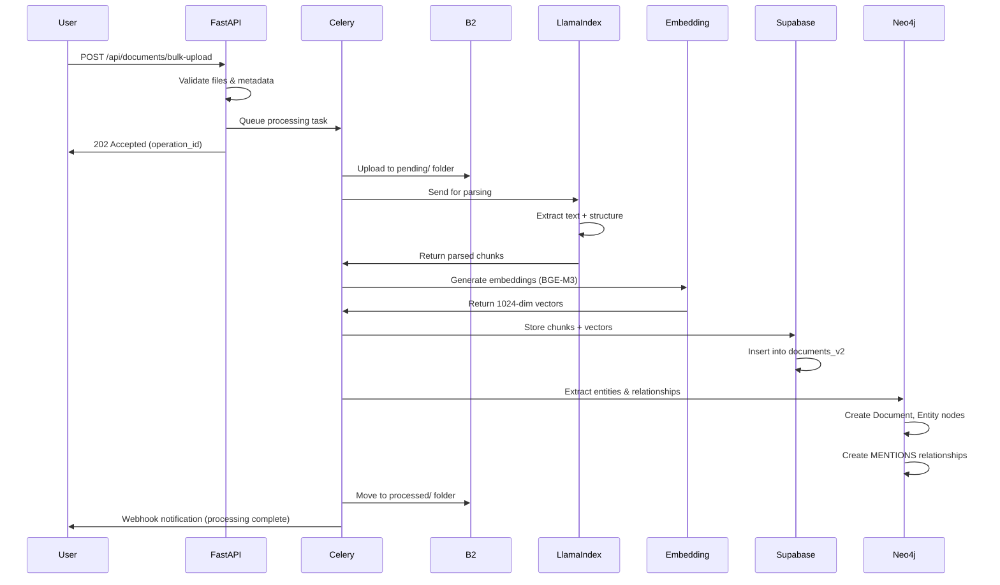

**Processing Steps**:

1. **Upload** (FastAPI):
   - Validate file type (PDF, DOCX, TXT, etc.)
   - Check file size (max 100MB)
   - Generate operation_id
   - Queue Celery task

2. **Storage** (Backblaze B2):
   - Upload to `pending/` folder
   - Path: `pending/{user_id}/{timestamp}/{filename}`

3. **Parsing** (LlamaIndex):
   - Extract text from PDF/DOCX
   - Detect structure (headings, tables, lists)
   - Chunk into semantic units (512 tokens avg)

4. **Embedding** (BGE-M3):
   - Generate 1024-dim vectors for each chunk
   - Batch processing (32 chunks at a time)
   - Store with chunk metadata

5. **Vector Storage** (Supabase):
   - Insert into `documents_v2` table
   - Create HNSW index for similarity search
   - Link to user via RLS policies

6. **Graph Sync** (Neo4j):
   - Extract entities (people, orgs, locations)
   - Create Document node
   - Create Entity nodes
   - Create MENTIONS relationships

7. **Finalization** (B2):
   - Move from `pending/` to `processed/`
   - Update metadata
   - Send webhook notification

**B2 Folder Structure**:
```
jb-course-kb/
├── pending/                    # Awaiting processing
│   └── {user_id}/
│       └── {timestamp}/
│           └── document.pdf
├── processed/                  # Successfully processed
│   └── {user_id}/
│       └── {document_id}/
│           └── document.pdf
├── failed/                     # Failed processing
│   └── {user_id}/
│       └── {timestamp}/
│           ├── document.pdf
│           └── error.log
└── crewai/                     # CrewAI assets (Task 40)
    └── assets/
        └── {department}/
            └── {asset_type}/
                └── {execution_id}/
                    └── report.md
```

---

## CrewAI Multi-Agent Orchestration

### Multi-Document Analysis Workflow

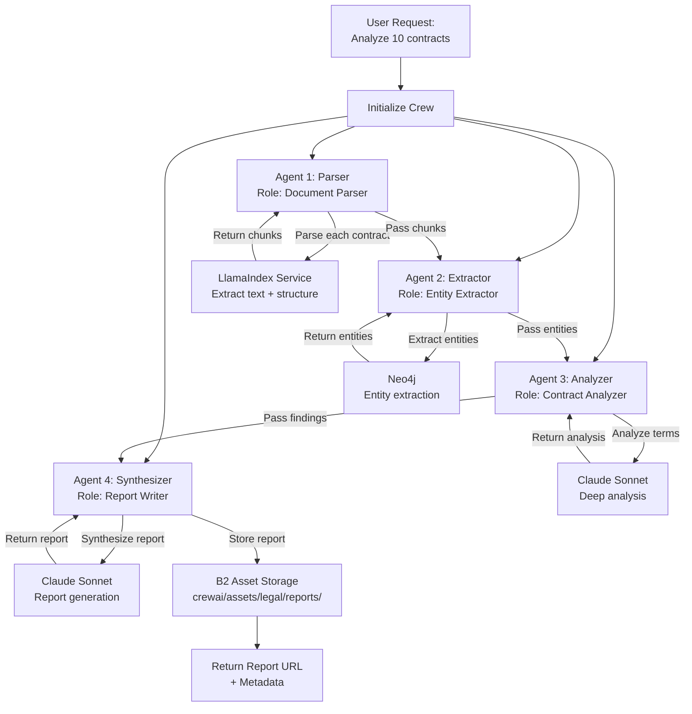

**Agent Configuration Example**:

```python
# Agent 1: Document Parser
parser_agent = Agent(
    role="Document Parser",
    goal="Parse all 10 contracts and extract structured data",
    tools=["llamaindex"],
    backstory="Expert in document parsing with 10 years experience"
)

# Agent 2: Entity Extractor
extractor_agent = Agent(
    role="Entity Extractor",
    goal="Extract all entities (parties, dates, amounts) from contracts",
    tools=["neo4j"],
    backstory="Specialist in legal entity extraction"
)

# Agent 3: Contract Analyzer
analyzer_agent = Agent(
    role="Contract Analyzer",
    goal="Analyze contract terms and identify risks",
    tools=["claude"],
    backstory="Contract law expert with focus on risk assessment"
)

# Agent 4: Report Writer
synthesizer_agent = Agent(
    role="Report Writer",
    goal="Synthesize findings into executive summary",
    tools=["claude"],
    backstory="Technical writer specializing in legal reports"
)

# Create Crew
crew = Crew(
    agents=[parser_agent, extractor_agent, analyzer_agent, synthesizer_agent],
    tasks=[parse_task, extract_task, analyze_task, synthesize_task],
    process="sequential"  # Or "parallel" for independent tasks
)

# Execute
result = crew.kickoff(inputs={"contracts": contract_ids})
```

**Asset Storage (Task 40)**:

Agents store outputs in B2 with organized structure:

```
crewai/assets/
├── legal/
│   ├── reports/
│   │   └── exec_20250117_120000/
│   │       └── contract_analysis.md
│   ├── analysis/
│   │   └── exec_20250117_120000/
│   │       └── risk_assessment.json
│   └── structured_data/
│       └── exec_20250117_120000/
│           └── entities.csv
```

---

## Caching Architecture

### Semantic Caching (Task 43.3)

```mermaid
graph TB
    Query[User Query:<br/>"What are CA insurance requirements?"] --> Hash[Generate MD5 Hash]

    Hash --> L1{L1 Cache Check<br/>Exact Match}
    L1 -->|Hit| ReturnL1[Return Cached<br/>~50ms<br/>In-memory]

    L1 -->|Miss| L2{L2 Cache Check<br/>Redis}
    L2 -->|Hit| ReturnL2[Return Cached<br/>~300ms<br/>Redis]

    L2 -->|Miss| Embed[Generate Embedding<br/>BGE-M3 1024-dim]

    Embed --> Semantic{Semantic Search<br/>Redis SCAN}

    Semantic -->|Similarity >= 0.95| ReturnSemantic[Return Similar Result<br/>~500ms<br/>Cosine similarity]

    Semantic -->|Similarity < 0.95| Process[Process Query<br/>Full pipeline]

    Process --> StoreCache[Store in Cache<br/>Hash + Embedding + Result]
    StoreCache --> ReturnFresh[Return Fresh Result<br/>~5-11s]

    ReturnL1 --> End[Response to User]
    ReturnL2 --> End
    ReturnSemantic --> End
    ReturnFresh --> End
```

**Cache Layers**:

**L1: In-Memory Cache** (FastAPI process)
- Exact hash match only
- TTL: 5 minutes
- Capacity: 1000 entries (LRU eviction)
- Latency: ~50ms

**L2: Redis Cache** (Upstash)
- Exact hash match + semantic similarity
- TTL: 30 minutes (configurable per endpoint)
- Capacity: Unlimited (serverless)
- Latency: ~300ms (exact), ~500ms (semantic)

**Semantic Similarity Matching**:
1. Generate embedding for new query (BGE-M3)
2. SCAN Redis for cached entries with embeddings
3. Calculate cosine similarity for each
4. If similarity >= 0.95 (threshold), return cached result
5. Otherwise, process query and cache with embedding

**Cache Performance** (from load tests):
- First request (uncached): ~11,223ms (adaptive), ~5,581ms (auto)
- Cached request (exact match): ~362ms average
- Cached request (semantic match): ~500-800ms
- Cache hit rate: 66.7% for similar queries, 100% for exact queries
- Speedup: 96.7% improvement (uncached vs cached)

**Cache Key Format**:
```
{namespace}:{md5_hash}

Example:
adaptive:5d41402abc4b2a76b9719d911017c592
auto:098f6bcd4621d373cade4e832627b4f6
```

**Cached Data Structure**:
```json
{
  "query": "What are California insurance requirements?",
  "result": {
    "answer": "California requires...",
    "sources": [...]
  },
  "embedding": [0.123, 0.456, ...],  // 1024-dim vector
  "cached_at": "2025-01-17T12:00:00Z"
}
```

---

## Security & RBAC

### API Key Lifecycle (Task 41.1)

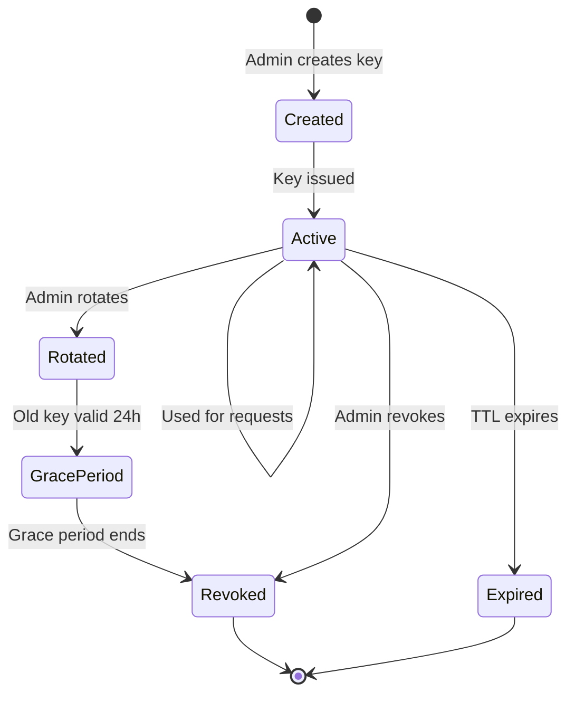

**Key Creation Flow**:

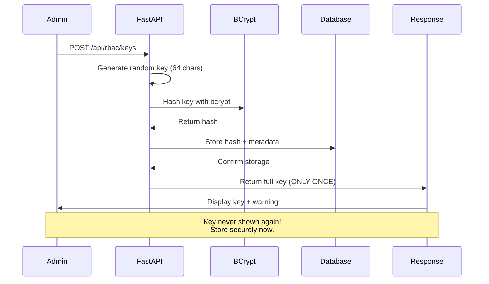

**Security Features**:
- Keys hashed with bcrypt (cost factor: 12)
- Full key shown ONLY at creation
- Prefix stored for identification (e.g., "sk_live_a1b2")
- 90-day rotation recommended
- 24-hour grace period for rotation
- Rate limiting per key (configurable)
- Audit logging for all key operations

---

### Row-Level Security (RLS) Flow

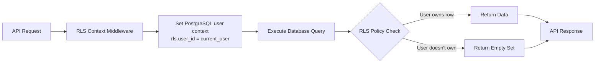

**RLS Policies**:

```sql
-- Example: documents_v2 table
CREATE POLICY "Users can only access their own documents"
  ON documents_v2
  FOR ALL
  USING (user_id = current_setting('rls.user_id')::uuid);

-- Enable RLS
ALTER TABLE documents_v2 ENABLE ROW LEVEL SECURITY;
```

**Protected Tables** (Task 41.2):
1. documents_v2
2. record_manager_v2
3. tabular_document_rows
4. knowledge_entities
5. knowledge_relationships
6. user_memory_nodes
7. user_memory_edges
8. user_document_connections
9. chat_sessions
10. chat_messages
11. document_feedback
12. query_performance_log
13. error_logs
14. audit_logs

---

## Monitoring & Observability

### Metrics Collection Flow

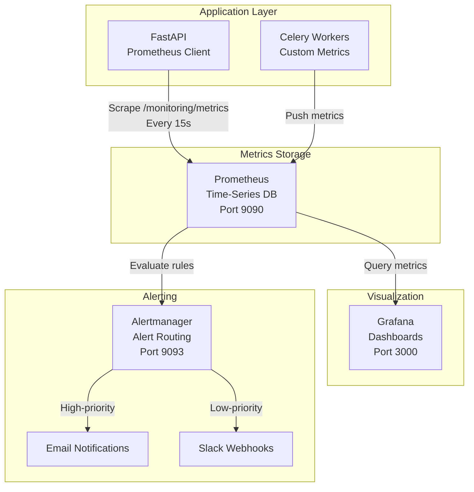

**Key Metrics**:

**Query Metrics**:
- `empire_query_requests_total{endpoint="adaptive"}` - Total query count
- `empire_query_latency_seconds{endpoint="adaptive"}` - Query latency histogram
- `empire_query_errors_total{endpoint="adaptive"}` - Error count

**Cache Metrics**:
- `empire_cache_hits_total{namespace="adaptive"}` - Cache hit count
- `empire_cache_misses_total{namespace="adaptive"}` - Cache miss count
- `empire_cache_hit_rate{namespace="adaptive"}` - Hit rate gauge

**Document Metrics**:
- `empire_documents_total` - Total document count
- `empire_documents_processing` - Documents currently processing
- `empire_document_processing_duration_seconds` - Processing time histogram

**Celery Metrics**:
- `celery_tasks_total{state="success"}` - Task completion count
- `celery_task_duration_seconds` - Task duration histogram
- `celery_workers_active` - Active worker count

**Alert Examples**:

```yaml
# High query latency alert
- alert: HighQueryLatency
  expr: histogram_quantile(0.95, empire_query_latency_seconds) > 20
  for: 5m
  labels:
    severity: warning
  annotations:
    summary: "95th percentile query latency above 20s"

# Cache hit rate degradation
- alert: LowCacheHitRate
  expr: empire_cache_hit_rate{namespace="adaptive"} < 0.4
  for: 10m
  labels:
    severity: info
  annotations:
    summary: "Cache hit rate below 40% for adaptive queries"

# Document processing failures
- alert: HighDocumentFailureRate
  expr: rate(empire_documents_failed_total[5m]) > 0.1
  for: 5m
  labels:
    severity: critical
  annotations:
    summary: "Document processing failure rate above 10%"
```

**Grafana Dashboard Panels**:
1. Query latency over time (P50, P95, P99)
2. Cache hit rate trends
3. Document processing throughput
4. Celery task queue depth
5. Error rate by endpoint
6. Active user sessions
7. Cost tracking (LLM API usage)

---

## Quick Reference: Service Interaction Patterns

### Pattern 1: Synchronous Query

```
User → FastAPI → [Cache Check] → [Process] → FastAPI → User
Duration: 360ms (cached) or 5-11s (uncached)
```

### Pattern 2: Asynchronous Query

```
User → FastAPI → Celery → User (202 Accepted)
User → FastAPI → [Poll Status] → User (200 OK with result)
Duration: Variable (1s - 5min)
```

### Pattern 3: Document Upload

```
User → FastAPI → Celery (async) → B2 + LlamaIndex + Embedding + Supabase + Neo4j
User ← FastAPI (202 Accepted)
Duration: 5-30s per document
```

### Pattern 4: Multi-Agent Workflow

```
User → FastAPI → CrewAI → [Agent1 → Agent2 → Agent3 → Agent4] → B2 (asset) → User
Duration: 30s - 10min
```

---

## Performance Benchmarks

### Query Performance (from load tests)

| Endpoint | Uncached Avg | Cached Avg | P95 | Cache Hit Rate |
|----------|--------------|------------|-----|----------------|
| /api/query/adaptive | 11,223ms | 362ms | 19,453ms | 11.1% (cold start) |
| /api/query/auto | 5,581ms | 362ms | 8,424ms | 11.1% (cold start) |
| /api/query/auto (simple routing) | 5,581ms | 362ms | 8,424ms | 100% (warm cache) |

**Note**: Cache hit rates improve significantly with repeated queries. Semantic similarity matching achieves 66.7% hit rate for variations of the same query.

### Document Processing Performance

| File Type | Avg Size | Processing Time | Throughput |
|-----------|----------|-----------------|------------|
| PDF | 2MB | 8-12s | 5-7 docs/min |
| DOCX | 500KB | 3-5s | 12-20 docs/min |
| TXT | 100KB | 1-2s | 30-60 docs/min |

### Caching Performance

| Cache Type | Latency | Hit Rate | TTL |
|------------|---------|----------|-----|
| L1 (In-Memory) | ~50ms | Variable | 5 min |
| L2 (Redis Exact) | ~300ms | 100% (exact match) | 30 min |
| L2 (Redis Semantic) | ~500-800ms | 66.7% (similar queries) | 30 min |

---

## Troubleshooting Flows

### Query Timeout Debugging

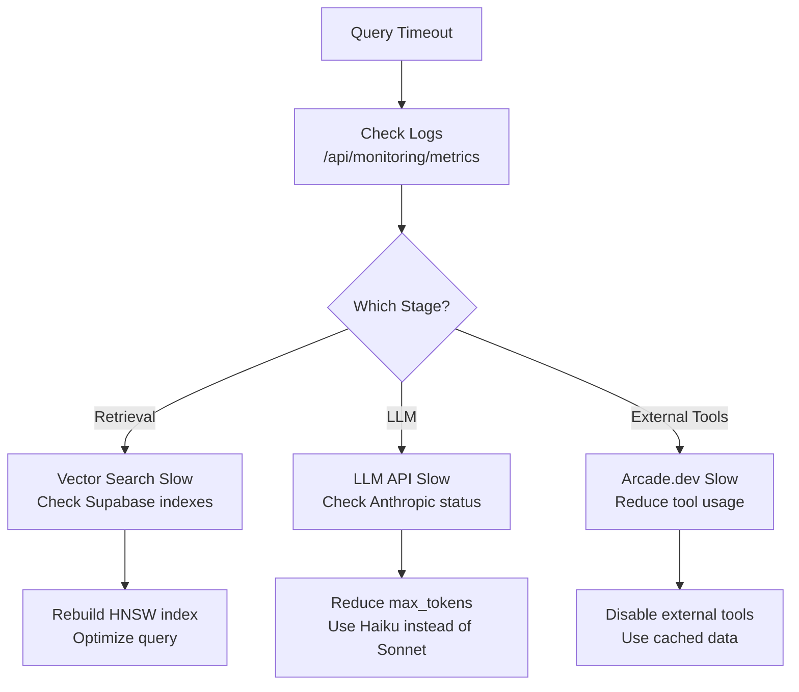

### Cache Miss Investigation

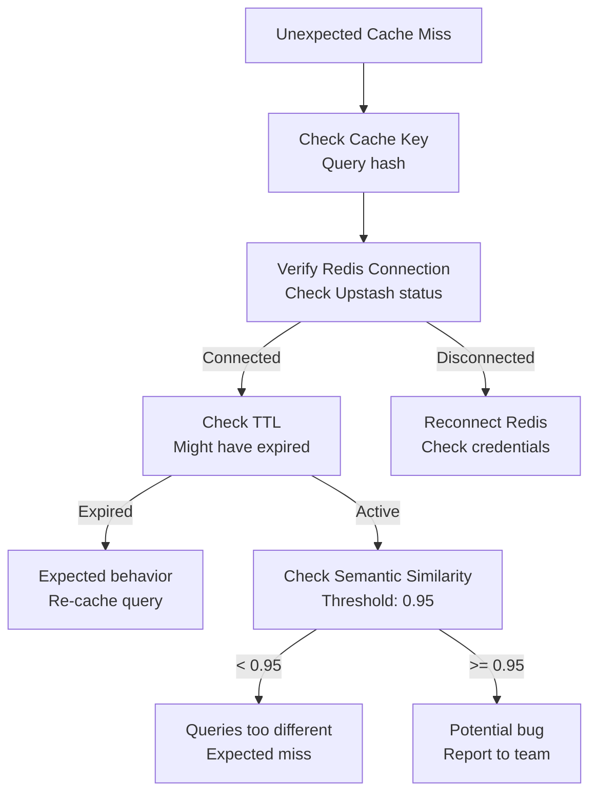

---

## Additional Resources

### Related Documentation
- [API_REFERENCE.md](./API_REFERENCE.md) - Complete API endpoint documentation
- [SECURITY.md](./SECURITY.md) - Security best practices (Task 41)
- [ENCRYPTION_VERIFICATION_TASK41_3.md](./ENCRYPTION_VERIFICATION_TASK41_3.md) - Multi-layer encryption details

### External Services
- **Clerk Documentation**: https://clerk.com/docs
- **LangGraph Documentation**: https://langchain-ai.github.io/langgraph/
- **Arcade.dev Documentation**: https://docs.arcade.dev/
- **Supabase Documentation**: https://supabase.com/docs
- **Neo4j Documentation**: https://neo4j.com/docs/

### Monitoring Dashboards
- **Prometheus**: http://localhost:9090 (local) or https://jb-empire-api.onrender.com/monitoring/metrics
- **Grafana**: http://localhost:3000 (local, admin/empiregrafana123)
- **Flower (Celery)**: http://localhost:5555 (local, admin/empireflower123)

---

**Last Updated**: 2025-01-17
**Version**: 7.3.0
**Documentation Maintainer**: Empire Development Team
