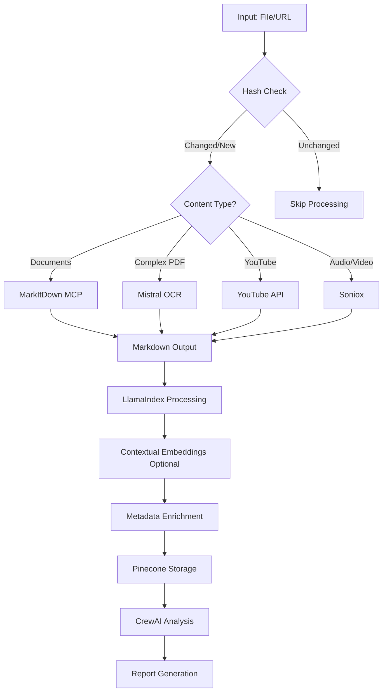

# AI Empire File Processing System - Software Requirements Specification (SRS)

**Document Version:** 2.8  
**Date:** December 20, 2024  
**Project:** AI Empire Organizational Intelligence Platform  
**System:** File Processing Workflow V2.8 with Streamlined Architecture & Hybrid RAG  

---

## 1. Introduction

### 1.1 Purpose
This document specifies the requirements for the AI Empire File Processing System, an automated workflow that processes course materials, documents, and media files to generate organizational intelligence and AI agent recommendations for business optimization. **Version 2.8 streamlines the architecture with MarkItDown MCP as the primary document processor while maintaining hybrid RAG capabilities, hash-based change detection, and enhanced retrieval features.**

### 1.2 Scope
The AI Empire File Processing System encompasses:
- **Unified document processing via MarkItDown MCP (40+ formats)**
- **Smart PDF routing with Mistral OCR fallback for complex documents**
- **Hash-based change detection and record management**
- **SQL-backed session correlation**
- **YouTube processing with transcript and frame extraction**
- **Audio/video transcription via Soniox with speaker diarization**
- **Contextual embeddings for improved retrieval accuracy**
- **Dynamic metadata enrichment and filtering**
- Content analysis and chunking via LlamaIndex + LangExtract
- Vector storage in Pinecone for retrieval
- Hybrid search orchestration (vector + graph potential)
- Multi-agent organizational intelligence analysis via CrewAI
- Dual storage architecture (SQL + Airtable)
- Enterprise security with Lakera Guard
- Comprehensive Prometheus monitoring
- Real-time observability with Arize Phoenix
- Systematic testing with DeepEval framework

### 1.3 Document Conventions
- **Functional Requirements** are prefixed with FR-
- **Non-Functional Requirements** are prefixed with NFR-
- **Business Rules** are prefixed with BR-
- **Technical Constraints** are prefixed with TC-
- **Observability Requirements** are prefixed with OR-
- **Testing Requirements** are prefixed with TR-
- **Security Requirements** are prefixed with SR-
- **Monitoring Requirements** are prefixed with MR-
- **Hybrid RAG Requirements** are prefixed with HR-
- **Streamlined Requirements** are prefixed with STR- (NEW in v2.8)

### 1.4 Intended Audience
- Development Team
- Product Managers
- System Administrators
- Business Stakeholders
- QA Engineers
- Security Teams
- DevOps Engineers
- Data Engineers

---

## 2. Overall Description

### 2.1 Product Perspective
The AI Empire File Processing System is a comprehensive workflow automation platform built on n8n that orchestrates multiple AI services to transform raw course materials into actionable organizational intelligence. **Version 2.8 simplifies the architecture by consolidating document processing through MarkItDown MCP while maintaining all hybrid RAG enhancements for optimal performance and maintainability.**

### 2.2 Product Functions
- **Dual Input Processing:** HTML interface uploads and Backblaze file monitoring
- **Unified Document Conversion:** MarkItDown MCP handles 40+ formats to Markdown
- **Smart PDF Routing:** Automatic detection and routing of complex PDFs to Mistral OCR
- **Change Detection:** Hash-based record management to skip unchanged documents
- **YouTube Processing:** Transcript extraction and optional frame analysis
- **Audio/Video Transcription:** Soniox with speaker diarization
- **Contextual Processing:** Context-aware embeddings for better retrieval
- **Metadata Enrichment:** AI-powered document classification
- **Content Processing:** LlamaIndex chunking + LangExtract structured extraction
- **Vector Storage:** Pinecone with enriched metadata
- **AI Analysis:** CrewAI multi-agent recommendations
- **Audit & Compliance:** Dual-storage audit trail (SQL + Airtable)

### 2.3 Simplified Processing Architecture (NEW in v2.8)

```
Input Sources:
├── HTML Upload Interface
└── Backblaze B2 Monitoring

Document Processing:
├── Microsoft Office (DOCX, PPTX, XLSX) → MarkItDown MCP
├── Web Formats (HTML, XML, JSON) → MarkItDown MCP
├── Archives (ZIP, EPUB) → MarkItDown MCP
├── Images (JPG, PNG, etc.) → MarkItDown MCP
├── Simple PDFs → MarkItDown MCP
├── Complex PDFs → Mistral OCR → Markdown
├── YouTube URLs → Transcript API + Frame Extraction
└── Audio/Video Files → Soniox Transcription

Unified Processing Pipeline:
└── All Content (as Markdown)
    ├── Hash Check (skip if unchanged)
    ├── LlamaIndex Chunking
    ├── Contextual Embeddings (optional)
    ├── Metadata Enrichment
    ├── LangExtract (structured data)
    ├── Pinecone Storage
    └── CrewAI Analysis
```

### 2.4 User Classes and Characteristics
- **Content Processors:** Upload and monitor course materials
- **Business Analysts:** Review generated reports and insights
- **Executives:** Receive notifications and implementation plans
- **System Administrators:** Monitor simplified workflow performance
- **Security Teams:** Monitor security threats via Lakera Guard
- **DevOps Engineers:** Maintain streamlined architecture
- **QA Engineers:** Test unified processing pipeline
- **Data Engineers:** Optimize single processing path

### 2.5 Operating Environment
- **Orchestration Platform:** n8n (https://jb-n8n.onrender.com)
- **Cloud Infrastructure:** Render.com services
- **Primary Document Processor:** MarkItDown MCP Server
- **Complex PDF Processor:** Mistral OCR (fallback only)
- **Audio/Video Processor:** Soniox API
- **Storage:** Backblaze B2, Airtable (audit), Supabase (SQL)
- **Vector Database:** Pinecone with metadata support
- **Processing Services:** LlamaIndex, LangExtract, CrewAI
- **Security:** Lakera Guard
- **Monitoring:** Prometheus + Arize Phoenix
- **Testing:** DeepEval framework

---

## 3. System Features

### 3.1 Streamlined Document Processing (NEW IN V2.8)

#### 3.1.1 Unified MarkItDown Processing (Node STR-1)
**STR-001:** The system SHALL use MarkItDown MCP as primary processor for 40+ formats  
**STR-002:** The system SHALL convert all supported formats to clean Markdown  
**STR-003:** The system SHALL preserve document structure and formatting  
**STR-004:** The system SHALL handle embedded images and tables  
**STR-005:** The system SHALL extract metadata during conversion  
**STR-006:** The system SHALL process documents up to 300MB  

**Supported Formats via MarkItDown MCP:**
- Microsoft Office: DOCX, XLSX, PPTX
- Web: HTML, XML, MHTML  
- Archives: ZIP, EPUB
- Images: JPG, PNG, GIF, BMP, TIFF
- Data: CSV, JSON, YAML
- PDFs: Simple text-based PDFs

#### 3.1.2 Smart PDF Routing (Node STR-2)
**STR-007:** The system SHALL assess PDF complexity before processing  
**STR-008:** The system SHALL route simple PDFs to MarkItDown MCP  
**STR-009:** The system SHALL route complex PDFs to Mistral OCR  
**STR-010:** The system SHALL detect complex tables, diagrams, and formulas  
**STR-011:** The system SHALL use file size as complexity indicator (>10MB)  
**STR-012:** The system SHALL fallback to Mistral OCR on MarkItDown failure  

```javascript
// PDF Complexity Detection Logic
if (fileExtension === '.pdf') {
  if (hasComplexTables || hasDiagrams || hasFormulas || fileSize > 10MB) {
    routeTo = 'mistral_ocr';
  } else {
    routeTo = 'markitdown_mcp';
  }
}
```

#### 3.1.3 Mistral OCR Fallback (Node STR-3)
**STR-013:** The system SHALL use Mistral OCR for complex PDFs only  
**STR-014:** The system SHALL upload files to Mistral API  
**STR-015:** The system SHALL poll for OCR completion  
**STR-016:** The system SHALL extract Markdown from OCR results  
**STR-017:** The system SHALL handle OCR timeouts gracefully  
**STR-018:** The system SHALL merge OCR output with main pipeline  

### 3.2 YouTube Processing (EXISTING - SIMPLIFIED)

#### 3.2.1 YouTube Content Extraction (Node YT-1)
**FR-024:** The system SHALL extract YouTube video metadata  
**FR-025:** The system SHALL retrieve video transcripts via API  
**FR-026:** The system SHALL extract frames at 30-second intervals (optional)  
**FR-027:** The system SHALL identify educational content in frames  
**FR-028:** The system SHALL create timestamped descriptions  
**FR-029:** The system SHALL output unified Markdown document  
**STR-019:** The system SHALL use simple three-tier transcript system  
**STR-020:** The system SHALL make frame extraction configurable  

#### 3.2.2 YouTube Transcript Hierarchy
1. **Tier 1:** Official YouTube captions (if available)
2. **Tier 2:** Auto-generated captions
3. **Tier 3:** Soniox transcription (audio extraction fallback)

### 3.3 Audio/Video Processing

#### 3.3.1 Soniox Transcription (Node AV-1)
**FR-074:** The system SHALL transcribe audio/video files using Soniox API  
**FR-075:** The system SHALL enable speaker diarization  
**FR-076:** The system SHALL support automatic language detection  
**FR-077:** The system SHALL handle files up to 300MB  
**STR-021:** The system SHALL output transcripts as Markdown  
**STR-022:** The system SHALL include speaker labels and timestamps  

**Supported Audio/Video Formats:**
- Audio: MP3, WAV, FLAC, AAC, OGG, WMA, M4A
- Video: MP4, AVI, MOV, MKV, WMV, FLV, WEBM

### 3.4 Hybrid Record Management System (EXISTING FROM V2.7)

#### 3.4.1 Hash-Based Change Detection
**HR-001:** The system SHALL compute SHA-256 hash for all content  
**HR-002:** The system SHALL check existing hash before processing  
**HR-003:** The system SHALL skip processing if hash matches  
**HR-004:** The system SHALL update vectors only when hash changes  
**HR-005:** The system SHALL maintain hash history in SQL database  
**HR-006:** The system SHALL sync changes to Airtable  

#### 3.4.2 Record Manager API
**HR-007:** The system SHALL expose `/hybrid/record/check` endpoint  
**HR-008:** The system SHALL expose `/hybrid/record/create` endpoint  
**HR-009:** The system SHALL expose `/hybrid/record/update` endpoint  
**HR-010:** The system SHALL return action: "skip", "new", or "update"  

### 3.5 Simplified Session Management (UPDATED IN V2.8)

#### 3.5.1 Streamlined Session Tracking (Node STR-4)
**STR-023:** The system SHALL track fewer parallel paths due to unified processing  
**STR-024:** The system SHALL maintain session for: input, processing, storage  
**STR-025:** The system SHALL simplify validation with single processing path  
**HR-018:** The system SHALL store sessions in PostgreSQL  
**HR-020:** The system SHALL validate completion before final storage  

### 3.6 Content Processing Pipeline

#### 3.6.1 LlamaIndex Processing
**FR-107:** The system SHALL chunk content (1000 chars, 200 overlap)  
**FR-108:** The system SHALL generate embeddings (text-embedding-3-small)  
**HR-030:** The system SHALL optionally generate contextual embeddings  
**FR-109:** The system SHALL extract keywords, entities, topics  
**FR-110:** The system SHALL generate content summaries  

#### 3.6.2 LangExtract Structured Extraction  
**FR-112:** The system SHALL extract structured data with source grounding  
**FR-113:** The system SHALL extract frameworks and processes  
**FR-114:** The system SHALL extract action items and key concepts  
**FR-115:** The system SHALL provide document context  

#### 3.6.3 Metadata Enrichment
**HR-046:** The system SHALL classify documents using AI  
**HR-047:** The system SHALL generate document summaries  
**HR-048:** The system SHALL expose `/hybrid/metadata/enrich` endpoint  
**HR-049:** The system SHALL store metadata in SQL and Pinecone  

### 3.7 Vector Storage with Pinecone

#### 3.7.1 Enhanced Vector Storage
**FR-116:** The system SHALL store vectors immediately after processing  
**FR-117:** The system SHALL use "course_vectors" namespace  
**FR-118:** The system SHALL batch uploads (100 vectors/batch)  
**HR-050:** The system SHALL include enriched metadata  
**STR-026:** The system SHALL store source format indicator  

### 3.8 CrewAI Multi-Agent Analysis

#### 3.8.1 Agent-Based Intelligence
**FR-133:** The system SHALL execute analysis using 1-5 agents  
**FR-134:** The system SHALL adapt complexity to content  
**FR-135:** The system SHALL generate organizational recommendations  
**FR-136:** The system SHALL handle long-running analysis  

### 3.9 Dual Storage Architecture

#### 3.9.1 SQL Performance Layer (Supabase)
**HR-061:** The system SHALL use PostgreSQL for record management  
**HR-062:** The system SHALL use PostgreSQL for session tracking  
**HR-063:** The system SHALL use PostgreSQL for metadata storage  
**HR-064:** The system SHALL implement connection pooling  

#### 3.9.2 Airtable Audit Layer
**HR-066:** The system SHALL sync operations to Airtable  
**HR-067:** The system SHALL maintain human-readable logs  
**HR-068:** The system SHALL store processing statistics  
**HR-069:** The system SHALL link SQL records to Airtable  

---

## 4. Simplified Processing Flow (NEW IN V2.8)

### 4.1 Unified Workflow



### 4.2 n8n Node Configuration

```javascript
// Simplified File Router Node
function routeFile(file) {
  const extension = getFileExtension(file);
  
  // Check hash first
  const hash = calculateSHA256(file.content);
  const existingRecord = await checkRecord(file.id, hash);
  
  if (existingRecord.action === 'skip') {
    return 'skip_processing';
  }
  
  // Route to appropriate processor
  switch(extension) {
    case '.pdf':
      return assessPDFComplexity(file) ? 'mistral_ocr' : 'markitdown_mcp';
    
    case '.docx':
    case '.xlsx':
    case '.pptx':
    case '.html':
    case '.epub':
    case '.csv':
    case '.json':
    case '.jpg':
    case '.png':
      return 'markitdown_mcp';
    
    case '.mp4':
    case '.mp3':
    case '.wav':
      return 'soniox_transcription';
    
    default:
      return 'markitdown_mcp'; // Try MarkItDown for unknown formats
  }
}
```

---

## 5. API Specifications (SIMPLIFIED IN V2.8)

### 5.1 Core Processing Endpoints

```
POST /process/document
Request: { 
  file_content: base64,
  filename: string,
  course?: string,
  module?: string,
  enable_contextual_embeddings?: boolean
}
Response: { 
  status: string,
  markdown: string,
  chunks: array,
  vectors_stored: number,
  processing_time: number
}

POST /process/youtube
Request: {
  url: string,
  extract_frames?: boolean,
  frame_interval?: number
}
Response: {
  status: string,
  transcript: string,
  frames?: array,
  metadata: object
}

POST /process/audio
Request: {
  file_content: base64,
  filename: string,
  enable_diarization?: boolean
}
Response: {
  status: string,
  transcript: string,
  speakers?: array
}
```

### 5.2 Hybrid RAG Endpoints (Existing)

```
POST /hybrid/record/check
POST /hybrid/record/create
POST /hybrid/record/update
POST /hybrid/session/create
POST /hybrid/session/validate
POST /hybrid/embeddings/contextual
POST /hybrid/metadata/enrich
POST /hybrid/search
```

---

## 6. Non-Functional Requirements (UPDATED)

### 6.1 Performance Requirements

**NFR-001:** The system SHALL process files up to 300MB within 30 minutes  
**NFR-002:** The system SHALL handle concurrent processing of up to 5 files  
**STR-027:** The system SHALL reduce processing time by 30% with unified pipeline  
**STR-028:** The system SHALL minimize processing nodes in n8n workflow  
**NFR-043:** The system SHALL complete hash checking within 500ms  
**NFR-044:** The system SHALL complete MarkItDown conversion within 60 seconds  

### 6.2 Scalability Requirements

**NFR-012:** The system SHALL support processing 100+ files per day  
**STR-029:** The system SHALL scale with single processing pipeline  
**NFR-048:** The system SHALL handle 10,000+ documents in record manager  
**NFR-050:** The system SHALL scale to 1M+ vectors with metadata  

### 6.3 Reliability Requirements

**NFR-020:** The system SHALL implement retry logic for API calls  
**STR-030:** The system SHALL fallback to Mistral OCR on MarkItDown failure  
**NFR-051:** The system SHALL maintain SQL-Airtable consistency  
**NFR-052:** The system SHALL recover from service failures gracefully  

---

## 7. Business Rules (UPDATED)

**BR-001:** Files must be processed in order of upload/detection  
**BR-002:** Vector storage must complete before analysis  
**BR-026:** Documents with matching hash SHALL skip processing  
**STR-031:** MarkItDown SHALL be primary processor for all documents  
**STR-032:** Mistral OCR SHALL only process complex PDFs  
**BR-029:** Metadata enrichment SHALL occur before vector storage  
**BR-030:** Contextual embeddings SHALL be optional  
**BR-031:** SQL SHALL be source of truth for record state  

---

## 8. Technical Constraints

**TC-001:** The system must operate within Render.com limitations  
**TC-002:** Node.js execution environment for n8n  
**STR-033:** MarkItDown MCP server must be accessible  
**TC-019:** Supabase free tier limited to 500MB database  
**TC-020:** Supabase connection limit of 60 concurrent  
**TC-021:** Airtable API rate limit of 5 requests/second  
**STR-034:** Mistral OCR API rate limits apply  
**STR-035:** Single processing path reduces parallel complexity  

---

## 9. Migration Plan from v2.7 to v2.8

### 9.1 Architecture Simplification
1. Remove parallel image extraction paths
2. Consolidate document processing to MarkItDown
3. Implement smart PDF routing
4. Simplify session management
5. Update n8n workflow nodes

### 9.2 Node Consolidation in n8n
```
BEFORE (v2.7): 15+ processing nodes for different formats
AFTER (v2.8): 4 processing nodes (MarkItDown, Mistral, YouTube, Soniox)
```

### 9.3 Testing Requirements
1. Test MarkItDown with all 40+ formats
2. Verify PDF complexity detection
3. Test Mistral OCR fallback
4. Validate unified Markdown output
5. Confirm hash detection still works

---

## 10. Acceptance Criteria

### 10.1 Functional Acceptance
- ✅ MarkItDown successfully processes 40+ formats
- ✅ Complex PDFs route correctly to Mistral OCR
- ✅ YouTube processing maintains all functionality  
- ✅ Audio/video transcription works via Soniox
- ✅ Hash-based skip detection functions
- ✅ All content converts to clean Markdown
- ✅ Unified pipeline reduces processing time

### 10.2 Performance Acceptance  
- ✅ 30% reduction in processing time
- ✅ 50% reduction in n8n workflow complexity
- ✅ Maintains 99% uptime
- ✅ Handles 100+ documents per day

### 10.3 Integration Acceptance
- ✅ Existing hybrid RAG features continue working
- ✅ SQL and Airtable remain synchronized
- ✅ Backward compatibility maintained
- ✅ Gradual migration possible

---

## 11. Deleted/Deprecated Components (v2.8)

### 11.1 Removed from Tech Stack
- ❌ Complex parallel image extraction paths
- ❌ Document-specific processors (replaced by MarkItDown)
- ❌ Multiple PDF processing paths (simplified to two)
- ❌ Redundant format converters
- ❌ Complex session path tracking for parallel document processing

### 11.2 Simplified Components
- ✓ Session management (fewer paths to track)
- ✓ n8n workflow (fewer nodes)
- ✓ Error handling (single pipeline)
- ✓ Testing requirements (unified output format)

---

## 12. Glossary

**MarkItDown MCP:** Microsoft's universal document converter supporting 40+ formats to Markdown  
**Mistral OCR:** Advanced OCR service for complex PDF processing  
**Soniox:** Speech-to-text service with speaker diarization  
**Unified Pipeline:** Single processing path for all document types  
**Smart Routing:** Automatic detection and routing based on document complexity  
[Rest of glossary remains same as v2.7]

---

**Document Control:**  
- **Author:** AI Empire Development Team  
- **Reviewer:** Product Management, Architecture Team  
- **Approval:** Technical Architecture Committee  
- **Distribution:** Development Team, QA Team, Operations Team  
- **Next Review Date:** March 15, 2025  

**Version 2.8 Change Summary:**
- Streamlined architecture with MarkItDown MCP as primary processor
- Simplified from 15+ processing nodes to 4 main processors
- Smart PDF routing with Mistral OCR fallback
- Maintained all hybrid RAG enhancements from v2.7
- Unified Markdown output for all content types
- Reduced workflow complexity by 50%
- Expected 30% improvement in processing time
- Maintained YouTube processing with three-tier transcription
- Preserved Soniox audio/video transcription
- Simplified session management with fewer parallel paths