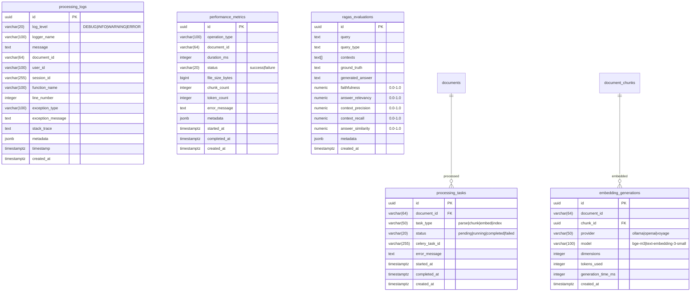

# Empire v7.3 Database Entity-Relationship Diagrams

This document contains comprehensive ER diagrams for all 50+ tables in the Empire database, organized by functional domain.

## Table of Contents
1. [Overview](#overview)
2. [Core Document System](#1-core-document-system)
3. [Chat & Session Management](#2-chat--session-management)
4. [CrewAI Multi-Agent System](#3-crewai-multi-agent-system)
5. [Agent Router & Routing](#4-agent-router--routing)
6. [User Memory Graph](#5-user-memory-graph)
7. [RBAC & Authentication](#6-rbac--authentication)
8. [Admin & Audit System](#7-admin--audit-system)
9. [Cost Tracking & Budgets](#8-cost-tracking--budgets)
10. [Monitoring & Alerts](#9-monitoring--alerts)
11. [Processing & Performance](#10-processing--performance)
12. [Complete Schema Overview](#11-complete-schema-overview)

---

## Overview

Empire v7.3 uses **Supabase PostgreSQL** with **pgvector** extension for vector similarity search. The database contains **50+ tables** organized across the following domains:

| Domain | Tables | Purpose |
|--------|--------|---------|
| Core Documents | 5 | Document storage, chunks, metadata, versions, approvals |
| Chat System | 4 | Sessions, messages, feedback, n8n integration |
| CrewAI | 7 | Agents, crews, executions, tasks, assets, interactions |
| Agent Router | 2 | Intelligent query routing and caching |
| User Memory | 3 | Knowledge graph nodes, edges, document connections |
| RBAC | 3 | Roles, user roles, API keys |
| Admin | 4 | Admin users, sessions, activity logs, batch operations |
| Cost Tracking | 4 | Cost entries, reports, alerts, budget configs |
| Monitoring | 3 | Alert rules, alert history, health checks |
| Processing | 4 | Tasks, logs, performance metrics, embeddings |
| Audit | 3 | Audit logs, RBAC audit, approval audit |
| Evaluation | 1 | RAGAS evaluation metrics |
| Config | 1 | System configuration |

**Vector Dimensions**: 1024 (BGE-M3 embeddings)
**Primary Keys**: UUID (uuid_generate_v4() or gen_random_uuid())
**Timestamps**: All tables include created_at, most include updated_at

---

## 1. Core Document System

The document system handles file storage, versioning, chunking, and approval workflows.


### Key Relationships:
- **documents → document_chunks**: One-to-many (document split into searchable chunks)
- **documents → document_versions**: One-to-many (version history)
- **documents → current_version_id**: One-to-one (points to active version)
- **document_approvals → approval_audit_log**: Complete audit trail for compliance

### Vector Search:
```sql
-- Similarity search on document_chunks
SELECT id, content, 1 - (embedding <=> query_embedding) as similarity
FROM document_chunks
WHERE 1 - (embedding <=> query_embedding) > 0.7
ORDER BY embedding <=> query_embedding
LIMIT 10;
```

---

## 2. Chat & Session Management

Handles user chat sessions, message history, feedback, and n8n workflow integration.


### Key Features:
- **Session Tracking**: Message counts, token usage, activity timestamps
- **Source Attribution**: Links responses to source documents (JSONB)
- **n8n Integration**: Separate table for n8n workflow message tracking
- **Feedback Loop**: User ratings and feedback for model improvement

---

## 3. CrewAI Multi-Agent System

Manages AI agents, crews, task executions, and generated assets for multi-agent workflows.


### Key Features:
- **Agent Configuration**: Role, goal, backstory, tools, LLM settings
- **Crew Orchestration**: Sequential, hierarchical, or parallel processing
- **Execution Tracking**: Task-level progress and results
- **Asset Storage**: B2-backed storage for generated reports/analysis
- **Agent Interactions**: Full communication logging with conflict resolution

---

## 4. Agent Router & Routing

Intelligent query routing system with semantic caching and decision history.


### Key Features:
- **Semantic Caching**: Vector similarity for cache lookups
- **Workflow Selection**: Routes to LangGraph, CrewAI, or Simple RAG
- **Confidence Scoring**: Multi-level confidence (high/medium/low)
- **Learning Loop**: Tracks success rates and user feedback
- **Cache Expiration**: 7-day TTL with hit counting

### Routing Logic:
```sql
-- Semantic cache lookup
SELECT id, query_text, selected_workflow, confidence_score
FROM agent_router_cache
WHERE is_active = true
  AND expires_at > NOW()
  AND 1 - (query_embedding <=> $1) > 0.85
ORDER BY 1 - (query_embedding <=> $1) DESC
LIMIT 1;
```

---

## 5. User Memory Graph

Knowledge graph for user-specific memory with nodes, edges, and document connections.


### Key Features:
- **Node Types**: Concepts, entities, preferences, facts
- **Edge Relationships**: Weighted connections between nodes
- **Document Links**: Connects memory to source documents
- **Importance Scoring**: Tracks node relevance over time
- **Vector Embeddings**: Semantic search on memory nodes

---

## 6. RBAC & Authentication

Role-based access control with API key management.


### Key Features:
- **Role Hierarchy**: System roles with custom permissions
- **API Key Security**: Hashed storage, prefix for identification
- **Rate Limiting**: Per-key rate limits
- **Expiration & Revocation**: Full lifecycle management

---

## 7. Admin & Audit System

Administrative user management, sessions, and activity logging.


### Key Features:
- **Admin Authentication**: Secure password hashing, session management
- **Activity Logging**: All admin actions tracked
- **Batch Operations**: Progress tracking for bulk operations
- **Audit Trail**: Complete event logging with old/new values

---

## 8. Cost Tracking & Budgets

API cost tracking, budget management, and alerting.


### Key Features:
- **Granular Tracking**: Per-service, per-category costs
- **Budget Alerts**: Threshold-based notifications
- **Monthly Reports**: Aggregated cost analysis
- **Multi-Channel Alerts**: Email, Slack, webhook support

---

## 9. Monitoring & Alerts

Production monitoring with alert rules and history.


### Key Features:
- **Alert Rules**: Configurable conditions and severity
- **Cooldown Periods**: Prevent alert fatigue
- **Resolution Tracking**: Alert lifecycle management
- **Health Checks**: Service availability monitoring

---

## 10. Processing & Performance

Document processing tasks and performance metrics.



### Key Features:
- **Task Tracking**: Celery task integration
- **Structured Logging**: Searchable processing logs
- **Performance Metrics**: Duration, size, token counts
- **RAGAS Evaluation**: RAG quality metrics

---

## 11. Complete Schema Overview

### All Tables Summary

| Table | Domain | Primary Key | Key Foreign Keys |
|-------|--------|-------------|------------------|
| documents | Core | uuid | current_version_id |
| document_versions | Core | uuid | document_id |
| document_chunks | Core | uuid | document_id |
| document_metadata | Core | uuid | document_id |
| document_approvals | Core | uuid | document_id, version_id |
| approval_audit_log | Core | uuid | approval_id |
| chat_sessions | Chat | varchar | - |
| chat_messages | Chat | uuid | session_id |
| chat_feedback | Chat | uuid | session_id, message_id |
| n8n_chat_histories | Chat | bigint | session_id |
| crewai_agents | CrewAI | uuid | - |
| crewai_crews | CrewAI | uuid | - |
| crewai_executions | CrewAI | uuid | crew_id, document_id |
| crewai_task_executions | CrewAI | uuid | execution_id, agent_id |
| crewai_task_templates | CrewAI | uuid | agent_id |
| crewai_generated_assets | CrewAI | uuid | execution_id, document_id |
| crewai_agent_interactions | CrewAI | uuid | execution_id, from_agent_id, to_agent_id |
| agent_router_cache | Router | uuid | - |
| routing_decision_history | Router | uuid | cache_entry_id |
| user_memory_nodes | Memory | uuid | - |
| user_memory_edges | Memory | uuid | source_node_id, target_node_id |
| user_document_connections | Memory | uuid | memory_node_id, document_id |
| roles | RBAC | uuid | - |
| user_roles | RBAC | uuid | role_id |
| api_keys | RBAC | uuid | role_id |
| admin_users | Admin | uuid | - |
| admin_sessions | Admin | uuid | admin_user_id |
| admin_activity_log | Admin | uuid | admin_user_id |
| batch_operations | Admin | uuid | initiated_by |
| audit_logs | Audit | uuid | - |
| cost_entries | Cost | uuid | - |
| budget_configs | Cost | uuid | - |
| cost_alerts | Cost | uuid | budget_config_id |
| cost_reports | Cost | uuid | - |
| alert_rules | Monitoring | uuid | - |
| alert_history | Monitoring | uuid | rule_id |
| health_checks | Monitoring | uuid | - |
| processing_tasks | Processing | uuid | document_id |
| processing_logs | Processing | uuid | - |
| performance_metrics | Processing | uuid | - |
| embedding_generations | Processing | uuid | chunk_id |
| ragas_evaluations | Evaluation | uuid | - |
| system_config | Config | uuid | modified_by |

### Foreign Key Relationships Summary

```
documents
├── document_chunks (document_id)
├── document_metadata (document_id)
├── document_versions (document_id)
│   └── documents.current_version_id
├── document_approvals (document_id, version_id)
│   └── approval_audit_log (approval_id)
├── crewai_executions (document_id)
├── crewai_generated_assets (document_id)
└── user_document_connections (document_id)

chat_sessions
├── chat_messages (session_id)
│   └── chat_feedback (message_id)
├── chat_feedback (session_id)
└── n8n_chat_histories (session_id)

crewai_crews
└── crewai_executions (crew_id)
    ├── crewai_task_executions (execution_id)
    ├── crewai_generated_assets (execution_id)
    └── crewai_agent_interactions (execution_id)

crewai_agents
├── crewai_task_executions (agent_id)
├── crewai_task_templates (agent_id)
└── crewai_agent_interactions (from_agent_id, to_agent_id)

agent_router_cache
└── routing_decision_history (cache_entry_id)

user_memory_nodes
├── user_memory_edges (source_node_id, target_node_id)
└── user_document_connections (memory_node_id)

roles
├── user_roles (role_id)
└── api_keys (role_id)

admin_users
├── admin_sessions (admin_user_id)
├── admin_activity_log (admin_user_id)
├── batch_operations (initiated_by)
└── system_config (modified_by)

budget_configs
└── cost_alerts (budget_config_id)

alert_rules
└── alert_history (rule_id)
```

---

## Appendix A: Index Strategy

### Vector Indexes (HNSW)
```sql
-- Document chunk embeddings
CREATE INDEX idx_document_chunks_embedding ON document_chunks
USING hnsw (embedding vector_cosine_ops) WITH (m = 16, ef_construction = 64);

-- Agent router cache embeddings
CREATE INDEX idx_router_cache_embedding ON agent_router_cache
USING hnsw (query_embedding vector_cosine_ops) WITH (m = 16, ef_construction = 64);

-- User memory node embeddings
CREATE INDEX idx_memory_nodes_embedding ON user_memory_nodes
USING hnsw (embedding vector_cosine_ops) WITH (m = 16, ef_construction = 64);
```

### B-tree Indexes (Lookups)
```sql
-- Document lookups
CREATE INDEX idx_documents_user ON documents(uploaded_by);
CREATE INDEX idx_documents_department ON documents(department);
CREATE INDEX idx_documents_status ON documents(processing_status);

-- Chat session lookups
CREATE INDEX idx_chat_sessions_user ON chat_sessions(user_id);
CREATE INDEX idx_chat_messages_session ON chat_messages(session_id);

-- Audit log queries
CREATE INDEX idx_audit_logs_user ON audit_logs(user_id);
CREATE INDEX idx_audit_logs_timestamp ON audit_logs(timestamp);
CREATE INDEX idx_audit_logs_event_type ON audit_logs(event_type);
```

---

## Appendix B: Row-Level Security (RLS)

All user-facing tables have RLS policies enabled:

```sql
-- Example: documents table RLS
ALTER TABLE documents ENABLE ROW LEVEL SECURITY;

CREATE POLICY documents_user_isolation ON documents
    FOR ALL
    USING (uploaded_by = auth.uid()::text OR
           EXISTS (SELECT 1 FROM user_roles ur
                   JOIN roles r ON ur.role_id = r.id
                   WHERE ur.user_id = auth.uid()::text
                   AND r.role_name = 'admin'));
```

Tables with RLS enabled:
- documents, document_chunks, document_metadata
- chat_sessions, chat_messages, chat_feedback
- user_memory_nodes, user_memory_edges, user_document_connections
- audit_logs, processing_logs

---

## Version History

| Version | Date | Changes |
|---------|------|---------|
| 1.0 | 2025-01-25 | Initial ER diagrams for Empire v7.3 |

---

*Generated for Empire v7.3 - Task 5.2 (Data Model Documentation)*
