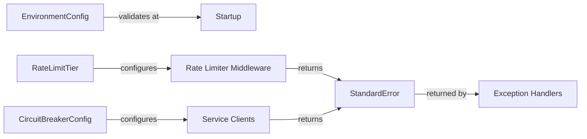

# Data Model: Production Readiness Improvements

**Branch**: `009-production-readiness` | **Date**: 2025-01-15

## Overview

This feature primarily deals with configuration objects and API response models rather than database entities. All models are in-memory or API response structures.

---

## Entity: EnvironmentConfig

**Purpose**: Represents validated environment configuration at startup

**Location**: `app/core/startup_validation.py`

```python
from typing import List, Dict
from pydantic import BaseModel

class EnvironmentConfig(BaseModel):
    """Validated environment configuration."""

    critical_vars: List[str]
    """List of critical environment variables that must be present."""

    recommended_vars: List[str]
    """List of recommended environment variables that may be missing."""

    missing_critical: List[str] = []
    """Critical variables that are missing (causes startup failure)."""

    missing_recommended: List[str] = []
    """Recommended variables that are missing (logged as warning)."""

    validated: bool = False
    """Whether validation has completed successfully."""

# Constants
CRITICAL_ENV_VARS = [
    "SUPABASE_URL",
    "SUPABASE_SERVICE_KEY",
    "REDIS_URL",
    "ANTHROPIC_API_KEY",
    "ENVIRONMENT",
]

RECOMMENDED_ENV_VARS = [
    "NEO4J_URI",
    "NEO4J_PASSWORD",
    "LLAMAINDEX_SERVICE_URL",
    "CREWAI_SERVICE_URL",
]
```

---

## Entity: RateLimitTier

**Purpose**: Defines rate limit configuration for endpoint patterns

**Location**: `app/middleware/rate_limit_tiers.py`

```python
from pydantic import BaseModel
from typing import Optional

class RateLimitTier(BaseModel):
    """Rate limit configuration for an endpoint pattern."""

    pattern: str
    """URL pattern to match (e.g., '/api/users/login')."""

    limit: int
    """Maximum requests allowed in window."""

    window: int = 60
    """Time window in seconds (default 60 = 1 minute)."""

    key_func: str = "ip"
    """Key function for rate limiting ('ip' or 'user_id')."""

    description: Optional[str] = None
    """Human-readable description of why this limit exists."""

# Configuration constants
RATE_LIMIT_TIERS = [
    RateLimitTier(
        pattern="/api/users/login",
        limit=5,
        window=60,
        key_func="ip",
        description="Brute force prevention"
    ),
    RateLimitTier(
        pattern="/api/users/register",
        limit=3,
        window=60,
        key_func="ip",
        description="Spam prevention"
    ),
    RateLimitTier(
        pattern="/api/documents/upload",
        limit=10,
        window=60,
        key_func="user_id",
        description="Resource protection"
    ),
    RateLimitTier(
        pattern="/api/query/*",
        limit=60,
        window=60,
        key_func="user_id",
        description="API abuse prevention"
    ),
    RateLimitTier(
        pattern="/api/orchestration/*",
        limit=30,
        window=60,
        key_func="user_id",
        description="AI cost protection"
    ),
]

DEFAULT_RATE_LIMIT = RateLimitTier(
    pattern="*",
    limit=200,
    window=60,
    key_func="ip",
    description="General protection"
)
```

---

## Entity: CircuitBreakerConfig

**Purpose**: Defines circuit breaker settings for external services

**Location**: `app/services/circuit_breaker.py` (extend existing)

```python
from pydantic import BaseModel

class CircuitBreakerConfig(BaseModel):
    """Circuit breaker configuration for an external service."""

    service_name: str
    """Name of the external service."""

    failure_threshold: int
    """Number of consecutive failures before opening circuit."""

    recovery_timeout: int
    """Seconds to wait before allowing test request (half-open state)."""

    timeout: float
    """Request timeout in seconds for this service."""

    connection_timeout: float = 5.0
    """Connection timeout in seconds (default 5s)."""

# Configuration constants
CIRCUIT_BREAKER_CONFIGS = {
    "llama_index": CircuitBreakerConfig(
        service_name="llama_index",
        failure_threshold=5,
        recovery_timeout=30,
        timeout=60.0
    ),
    "crewai": CircuitBreakerConfig(
        service_name="crewai",
        failure_threshold=3,
        recovery_timeout=60,
        timeout=120.0
    ),
    "ollama": CircuitBreakerConfig(
        service_name="ollama",
        failure_threshold=5,
        recovery_timeout=15,
        timeout=30.0
    ),
    "neo4j": CircuitBreakerConfig(
        service_name="neo4j",
        failure_threshold=3,
        recovery_timeout=30,
        timeout=15.0
    ),
    "b2": CircuitBreakerConfig(
        service_name="b2",
        failure_threshold=5,
        recovery_timeout=60,
        timeout=30.0
    ),
}
```

---

## Entity: StandardError

**Purpose**: Consistent error response structure for all API endpoints

**Location**: `app/models/errors.py` (extend existing)

```python
from datetime import datetime
from typing import Optional, Dict, Any
from pydantic import BaseModel, Field
from enum import Enum

class ErrorCode(str, Enum):
    """Standard error codes for API responses."""

    VALIDATION_ERROR = "VALIDATION_ERROR"
    AUTHENTICATION_ERROR = "AUTHENTICATION_ERROR"
    AUTHORIZATION_ERROR = "AUTHORIZATION_ERROR"
    NOT_FOUND = "NOT_FOUND"
    RATE_LIMITED = "RATE_LIMITED"
    EXTERNAL_SERVICE_ERROR = "EXTERNAL_SERVICE_ERROR"
    SERVICE_UNAVAILABLE = "SERVICE_UNAVAILABLE"
    INTERNAL_ERROR = "INTERNAL_ERROR"

class StandardError(BaseModel):
    """Standard error structure for API responses."""

    code: ErrorCode
    """Error code identifying the type of error."""

    message: str
    """Human-readable error message."""

    details: Optional[Dict[str, Any]] = None
    """Additional error details (field-specific errors, etc.)."""

    request_id: str
    """Unique request identifier for correlation."""

    timestamp: datetime = Field(default_factory=datetime.utcnow)
    """When the error occurred."""

class ErrorResponse(BaseModel):
    """API error response wrapper."""

    error: StandardError
    """The error details."""

# HTTP status code mapping
ERROR_CODE_STATUS_MAP = {
    ErrorCode.VALIDATION_ERROR: 400,
    ErrorCode.AUTHENTICATION_ERROR: 401,
    ErrorCode.AUTHORIZATION_ERROR: 403,
    ErrorCode.NOT_FOUND: 404,
    ErrorCode.RATE_LIMITED: 429,
    ErrorCode.EXTERNAL_SERVICE_ERROR: 502,
    ErrorCode.SERVICE_UNAVAILABLE: 503,
    ErrorCode.INTERNAL_ERROR: 500,
}
```

---

## Relationships



---

## Validation Rules

### EnvironmentConfig
- Empty string treated same as missing (`""` = not set)
- Critical vars: Must all be present or startup fails
- Recommended vars: Log warning if missing, continue startup

### RateLimitTier
- `limit` must be >= 1
- `window` must be >= 1 second
- `pattern` must be valid URL pattern

### CircuitBreakerConfig
- `failure_threshold` must be >= 1
- `recovery_timeout` must be >= 1 second
- `timeout` must be > `connection_timeout`

### StandardError
- `code` must be from ErrorCode enum
- `message` must be non-empty
- `request_id` must be valid UUID format
- `timestamp` defaults to current UTC time
