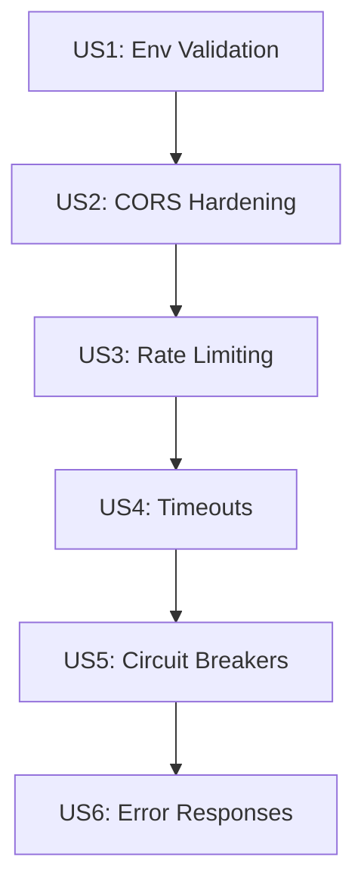

# Implementation Plan: Production Readiness Improvements

**Branch**: `009-production-readiness` | **Date**: 2025-01-15 | **Spec**: [spec.md](./spec.md)
**Input**: Feature specification from `/specs/009-production-readiness/spec.md`

## Summary

Implement production hardening for Empire v7.3 to improve production readiness from 85/100 to 100/100. This includes fail-fast startup validation for environment variables, CORS security enforcement in production, tiered rate limiting for sensitive endpoints, configurable timeouts for external service calls, circuit breakers for all external services, and standardized error response formats.

## Technical Context

**Language/Version**: Python 3.11
**Primary Dependencies**: FastAPI, httpx, redis, slowapi, structlog, pydantic v2
**Storage**: Supabase PostgreSQL (pgvector), Neo4j (knowledge graph), Upstash Redis (cache/broker)
**Testing**: pytest, pytest-asyncio
**Target Platform**: Linux server (Render deployment)
**Project Type**: web (FastAPI backend)
**Performance Goals**: <200ms p95 latency for API endpoints, <5s startup validation
**Constraints**: Zero-downtime deployment, backward compatible, multi-instance support
**Scale/Scope**: Existing 29 API route modules, 293+ endpoints

## Constitution Check

*GATE: Must pass before Phase 0 research. Re-check after Phase 1 design.*

| Gate | Status | Notes |
|------|--------|-------|
| Simplicity | PASS | Modifying existing middleware patterns, no new abstractions |
| No Over-Engineering | PASS | Only implementing what spec requires |
| Test Coverage | PASS | Unit tests for each new module |
| Backward Compatible | PASS | Feature flags for gradual rollout |
| Security First | PASS | Core purpose is security hardening |

## Project Structure

### Documentation (this feature)

```text
specs/009-production-readiness/
├── plan.md              # This file
├── research.md          # Phase 0 output
├── data-model.md        # Phase 1 output
├── quickstart.md        # Phase 1 output
├── contracts/           # Phase 1 output
└── tasks.md             # Phase 2 output
```

### Source Code (existing Empire structure)

```text
app/
├── core/
│   ├── startup_validation.py     # NEW: Environment variable validation
│   └── service_timeouts.py       # NEW: Timeout configuration constants
├── middleware/
│   ├── rate_limit.py             # MODIFY: Add tiered rate limiting
│   ├── error_handler.py          # MODIFY: Standardized error responses
│   └── security.py               # EXISTING: Add CORS hardening
├── services/
│   ├── llama_index_service.py    # MODIFY: Add timeout + circuit breaker
│   ├── crewai_service.py         # MODIFY: Add timeout + circuit breaker
│   ├── embedding_service.py      # MODIFY: Add timeout + circuit breaker
│   ├── neo4j_service.py          # MODIFY: Add timeout + circuit breaker
│   └── b2_storage.py             # MODIFY: Add timeout + circuit breaker
├── models/
│   └── errors.py                 # MODIFY: Standardized error codes
└── main.py                       # MODIFY: Add startup validation, CORS check

tests/
├── test_startup_validation.py    # NEW: Validation tests
├── test_rate_limiting.py         # NEW: Rate limit tests
├── test_circuit_breakers.py      # NEW: Circuit breaker tests
└── test_error_responses.py       # NEW: Error format tests
```

**Structure Decision**: Extending existing Empire FastAPI structure with new modules in `app/core/` for startup utilities and modifications to existing middleware and services.

## Complexity Tracking

No constitution violations. All changes follow existing patterns:
- Middleware pattern for rate limiting (existing)
- Circuit breaker pattern (existing in some services)
- Startup hooks in FastAPI (standard pattern)

---

## Phase 0: Research

### Research Tasks Completed

All technical decisions resolved from PRD and existing codebase analysis:

1. **Rate Limiting Library**: slowapi (already installed)
   - Decision: Use existing slowapi with Redis backend
   - Rationale: Already in use for default rate limiting
   - Alternative: Custom implementation rejected (unnecessary complexity)

2. **Circuit Breaker Pattern**: Custom implementation
   - Decision: Extend existing `app/services/circuit_breaker.py`
   - Rationale: Already implemented for some services
   - Alternative: pybreaker library rejected (existing solution works)

3. **Environment Validation**: Custom module
   - Decision: Create `app/core/startup_validation.py`
   - Rationale: Simple validation doesn't need external library
   - Alternative: pydantic-settings rejected (overkill for this use case)

4. **Timeout Implementation**: httpx built-in
   - Decision: Use httpx.Timeout with per-service configuration
   - Rationale: httpx already in use, native timeout support
   - Alternative: asyncio.wait_for rejected (less readable)

5. **Error Response Format**: Pydantic models
   - Decision: Extend `app/models/errors.py` with standard codes
   - Rationale: Type-safe, already used for validation errors
   - Alternative: Dict responses rejected (no type safety)

---

## Phase 1: Design

### Key Entities (from spec.md)

| Entity | Purpose | Storage |
|--------|---------|---------|
| EnvironmentConfig | Validated env var configuration | In-memory at startup |
| RateLimitTier | Rate limit configuration per endpoint | Code constants |
| CircuitBreakerConfig | Per-service circuit breaker settings | Code constants |
| StandardError | Consistent error response structure | API responses |

### Service Timeouts Configuration

| Service | Timeout | Connection Timeout | Rationale |
|---------|---------|-------------------|-----------|
| LlamaIndex | 60s | 5s | Document parsing can be slow |
| CrewAI | 120s | 5s | Multi-agent workflows |
| Ollama | 30s | 5s | Embedding generation |
| Neo4j | 15s | 5s | Graph queries |
| B2 Storage | 30s | 5s | File uploads |

### Circuit Breaker Configuration

| Service | Failure Threshold | Recovery Timeout |
|---------|------------------|------------------|
| LlamaIndex | 5 failures | 30s |
| CrewAI | 3 failures | 60s |
| Ollama | 5 failures | 15s |
| Neo4j | 3 failures | 30s |
| B2 Storage | 5 failures | 60s |

### Rate Limit Tiers

| Endpoint Pattern | Limit | Window | Rationale |
|-----------------|-------|--------|-----------|
| `/api/users/login` | 5 | 1 min | Brute force prevention |
| `/api/users/register` | 3 | 1 min | Spam prevention |
| `/api/documents/upload` | 10 | 1 min | Resource protection |
| `/api/query/*` | 60 | 1 min | API abuse prevention |
| `/api/orchestration/*` | 30 | 1 min | AI cost protection |
| Default | 200 | 1 min | General protection |

### Error Codes

| Code | HTTP Status | Description |
|------|-------------|-------------|
| VALIDATION_ERROR | 400 | Input validation failed |
| AUTHENTICATION_ERROR | 401 | Not authenticated |
| AUTHORIZATION_ERROR | 403 | Not authorized |
| NOT_FOUND | 404 | Resource not found |
| RATE_LIMITED | 429 | Rate limit exceeded |
| EXTERNAL_SERVICE_ERROR | 502 | External service failure |
| SERVICE_UNAVAILABLE | 503 | Service temporarily unavailable |
| INTERNAL_ERROR | 500 | Unexpected server error |

---

## Implementation Strategy

### MVP Scope (Phase 1 - Critical)
1. Environment variable validation at startup (US1)
2. CORS production hardening (US2)
3. Sensitive endpoint rate limiting (US3)

### Phase 2 - High Priority
4. External service timeouts (US4)
5. Circuit breaker coverage (US5)
6. Standardized error responses (US6)

### Dependencies



### Rollout Strategy

1. **Feature Flags**: Each improvement behind feature flag
2. **Gradual Rollout**: Deploy to staging first, monitor for 24h
3. **Backward Compatible**: All changes preserve existing behavior when flags off
