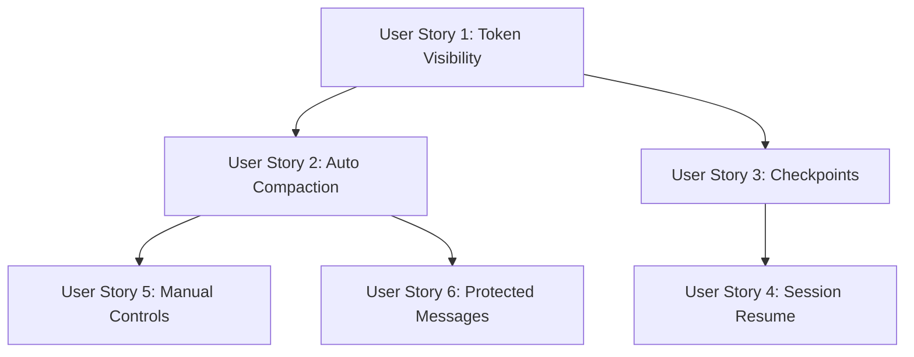

# Implementation Plan: Chat Context Window Management

**Branch**: `011-chat-context-management` | **Date**: 2025-01-19 | **Spec**: [spec.md](./spec.md)
**Input**: Feature specification from `/specs/011-chat-context-management/spec.md`

## Summary

Implement an intelligent chat context window management system that automatically condenses conversation history when approaching token limits, provides real-time visibility into context usage, enables crash recovery via checkpoints, and supports session resume across app restarts. Uses Claude Sonnet for high-quality summarization (with Haiku fast option) running in background to maintain responsiveness.

## Technical Context

**Language/Version**: Python 3.11 (Backend), TypeScript/React (Desktop Frontend)
**Primary Dependencies**: FastAPI, Anthropic SDK, tiktoken, Pydantic v2, structlog, Redis (Upstash)
**Storage**: Supabase PostgreSQL (checkpoints, sessions, memories), Redis (real-time state)
**Testing**: pytest, pytest-asyncio
**Target Platform**: Linux server (Render), macOS/Windows (Tauri Desktop)
**Project Type**: Web application (FastAPI backend + Tauri/React frontend)
**Performance Goals**: 15-30s typical compaction (Sonnet), 5-10s fast (Haiku), <100ms progress bar updates
**Constraints**: Background processing required (no blocking UI), 60s max compaction time, 5% token count accuracy
**Scale/Scope**: 1-3 active conversations per user, 200K tokens max before compaction

## Constitution Check

*GATE: Project uses existing Empire patterns - no constitution violations.*

- Library-First: Feature implemented as services (context_manager_service.py, checkpoint_service.py)
- CLI Interface: Slash commands (/compact, /save-progress) exposed via chat interface
- Test-First: Unit tests for services, integration tests for API endpoints
- Observability: Prometheus metrics, structured logging with structlog

## Project Structure

### Documentation (this feature)

```text
specs/011-chat-context-management/
├── spec.md              # Feature specification (COMPLETE)
├── plan.md              # This file
├── research.md          # Phase 0 output
├── data-model.md        # Phase 1 output
├── quickstart.md        # Phase 1 output
├── contracts/           # Phase 1 output (OpenAPI specs)
│   ├── context-api.yaml
│   ├── checkpoint-api.yaml
│   └── session-api.yaml
├── checklists/          # Quality checklists
│   └── requirements.md
└── tasks.md             # Phase 2 output (/speckit.tasks)
```

### Source Code (repository root)

```text
# Backend (FastAPI)
app/
├── services/
│   ├── context_manager_service.py      # NEW: Token counting, compaction orchestration
│   ├── summarization_service.py        # NEW: Claude Sonnet/Haiku summarization
│   ├── checkpoint_service.py           # NEW: Checkpoint storage and retrieval
│   └── session_resume_service.py       # NEW: Session management and recovery
├── routes/
│   ├── context_management.py           # EXTEND: Add compaction endpoints
│   ├── checkpoints.py                  # NEW: Checkpoint CRUD endpoints
│   └── sessions.py                     # NEW: Session resume endpoints
├── models/
│   ├── context_models.py               # NEW: Pydantic models for context
│   ├── checkpoint_models.py            # NEW: Pydantic models for checkpoints
│   └── session_models.py               # NEW: Pydantic models for sessions
├── tasks/
│   └── compaction_tasks.py             # NEW: Celery tasks for background compaction
└── core/
    └── token_counter.py                # NEW: tiktoken-based token counting

# Desktop Frontend (Tauri/React)
empire-desktop/
├── src/
│   ├── components/
│   │   ├── ContextProgressBar.tsx      # NEW: Token usage progress bar
│   │   ├── CompactionDivider.tsx       # NEW: Inline compaction summary
│   │   ├── SessionPicker.tsx           # NEW: Session resume UI
│   │   └── CheckpointBrowser.tsx       # NEW: Checkpoint timeline view
│   ├── hooks/
│   │   ├── useContextWindow.ts         # NEW: Context state management
│   │   └── useCheckpoints.ts           # NEW: Checkpoint operations
│   └── services/
│       ├── contextApi.ts               # NEW: Context API client
│       └── sessionApi.ts               # NEW: Session API client
└── tests/
    └── components/
        └── context/                    # NEW: Component tests

# Database Migrations
migrations/
├── 20250119_create_conversation_contexts.sql
├── 20250119_create_session_checkpoints.sql
├── 20250119_create_compaction_logs.sql
└── 20250119_create_session_memories.sql

# Tests
tests/
├── unit/
│   ├── test_context_manager_service.py
│   ├── test_summarization_service.py
│   ├── test_checkpoint_service.py
│   └── test_token_counter.py
├── integration/
│   ├── test_context_api.py
│   ├── test_checkpoint_api.py
│   └── test_session_api.py
└── e2e/
    └── test_compaction_flow.py
```

**Structure Decision**: Extends existing Empire FastAPI backend with new services and routes. Desktop frontend gets new React components for context visibility and session management.

## Implementation Phases

### Phase 1: Core Token Management (P1 - User Story 1)
**Goal**: Real-time context window visibility
**Files**: `token_counter.py`, `context_models.py`, `ContextProgressBar.tsx`
**Independent Test**: Progress bar shows accurate token count, updates on message send

### Phase 2: Automatic Compaction (P1 - User Story 2)
**Goal**: Background compaction with Sonnet/Haiku
**Files**: `context_manager_service.py`, `summarization_service.py`, `compaction_tasks.py`, `CompactionDivider.tsx`
**Independent Test**: Compaction triggers at 80%, runs in background, shows inline divider

### Phase 3: Checkpoint System (P2 - User Story 3)
**Goal**: Auto-checkpoints and crash recovery
**Files**: `checkpoint_service.py`, `checkpoint_models.py`, `checkpoints.py` routes
**Independent Test**: Checkpoint saved on code generation, recovery prompt on crash

### Phase 4: Session Resume (P2 - User Story 4)
**Goal**: Session picker and full context restoration
**Files**: `session_resume_service.py`, `SessionPicker.tsx`, `CheckpointBrowser.tsx`
**Independent Test**: Sessions listed on launch, resume restores full context

### Phase 5: Manual Controls & Polish (P3 - User Stories 5 & 6)
**Goal**: /compact command, protected messages, --fast flag
**Files**: Update existing services, add slash command handlers
**Independent Test**: /compact works with flags, protected messages preserved

## Dependencies



- **US1 blocks US2**: Token counting required for compaction trigger
- **US1 blocks US3**: Token count needed for checkpoint metadata
- **US2 blocks US5**: Compaction logic needed for /compact command
- **US3 blocks US4**: Checkpoint storage needed for session resume
- **US2 blocks US6**: Compaction logic needs protected message filtering

## Risk Mitigation

| Risk | Mitigation |
|------|------------|
| Summarization quality loss | Use Sonnet (95%+ retention), comprehensive prompt template |
| Long compaction times | Background processing, progress indicator, --fast option |
| Token count drift | Conservative buffers, handle overflow gracefully |
| Checkpoint storage costs | 50 checkpoint limit per session, 30-day TTL |
